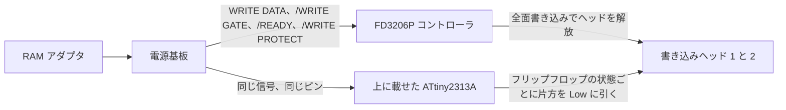

<div align="center">

<h1>fd3206-write-unlock</h1>

[English](README.md) | 日本語 | [简体中文](README.zh-CN.md) | [繁體中文（香港）](README.zh-HK.md)

<br>

<strong>FD3206P の上に ATtiny2313A を 1 個はんだ付けするだけで、ディスクシステムのドライブが再びディスク全面を書き換えられるようになります。</strong>

<br>
<br>

[](https://github.com/gufranco/fd3206-write-unlock/actions/workflows/ci.yml)
[](https://github.com/gufranco/fd3206-write-unlock/releases/latest)
[](https://scorecard.dev/viewer/?uri=github.com/gufranco/fd3206-write-unlock)
[](https://github.com/gufranco/fd3206-write-unlock/actions/workflows/ci.yml)
[](LICENSE)

</div>

<p align="center">
  <a href="#取り付け">取り付け</a> &nbsp;|&nbsp;
  <a href="#仕組み">仕組み</a> &nbsp;|&nbsp;
  <a href="#電源基板">電源基板</a> &nbsp;|&nbsp;
  <a href="https://github.com/gufranco/fd3206-write-unlock/releases">リリース</a> &nbsp;|&nbsp;
  <a href="#よくある質問">よくある質問</a>
</p>

<p align="center">
はんだ付け <b>8</b> か所 · パターン切断 <b>0</b> · 追加部品 <b>0</b> · フラッシュ <b>226</b> バイト · <b>15</b> 命令のエッジ割り込み · MISRA C:2012 の指摘 <b>0</b> · シミュレーション <b>13</b> シナリオ
</p>

---

```text
ATtiny2313A, pin 1 over FD3206P pin 1
  solder  4 5 6 10 13 14 15 20
  clip    1 2 3 7 8 9 11 12 16 17 18 19
```

> [!IMPORTANT]
> ファームウェアはホスト、静的解析、シミュレーションのすべての検査を通過していますが、実機のドライブではまだ動作確認していません。最初の書き込みには、失っても構わないディスクを使ってください。

<table>
<tr>
<td width="50%" valign="top">

**切断なし、配線なし**<br>
FD3206P に 8 本のピンを直接はんだ付けするだけ。ドライブの基板は切断せず、抵抗もジャンパ線も 2 個目のチップも追加しません。

</td>
<td width="50%" valign="top">

**Low に引くだけ、High は出さない**<br>
ヘッドのピンは出力 0 か入力のどちらかなので、同じピンを共有する FD3206P と短絡しません。

</td>
</tr>
<tr>
<td width="50%" valign="top">

**ヘッドまで 1.25 us**<br>
15 命令のアセンブリ割り込みが、WRITE DATA の各エッジから 10 サイクルでヘッドを切り替えます。最短エッジ間隔 4.7 us に十分収まります。

</td>
<td width="50%" valign="top">

**MISRA の指摘ゼロ**<br>
C17 をデバッグ版とリリース版の両方で MISRA C:2012 に照らして検査し、レジスタアクセスはすべて 1 つのアセンブリモジュールに隔離しています。

</td>
</tr>
<tr>
<td width="50%" valign="top">

**全命令を実行**<br>
13 の simavr シナリオがリリース版イメージを実行し、実行されない命令が 1 つでもあれば失敗します。論理は入力ポートの 65,536 通りすべてで検査しています。

</td>
<td width="50%" valign="top">

**リリースはテスト済みのバイナリ**<br>
GitHub の各リリースには、パイプラインがビルドしてテストした hex そのものと、その SHA-256 が添付されます。

</td>
</tr>
</table>

## 課題

1988 年後半以降のドライブは、以前の FD7201P に代わってミツミ製の FD3206P コントローラを使っています。RAM アダプタによる 1 ファイル単位の書き換えは許しますが、書き込みがディスク面全体に及んだ瞬間に書き込みヘッドを解放し、RAM アダプタはエラー 26 を報告します。このようなドライブでは、ディスク全体のバックアップや復元ができません。

## 解決策

従来の対策は、ドライブの書き込み段をコントローラの外に作り直すものです。WRITE DATA の立ち下がりエッジごとに反転するフリップフロップと、/READY、/WRITE PROTECT、/WRITE GATE がすべて Low のときだけ片方のヘッドを駆動するゲートです。このファームウェアはその書き込み段そのもので、コントローラの上に載るチップの中にあります。

| | このファームウェア | GAL16V8 モッドチップ | 従来の配線改造 |
|:--|:--:|:--:|:--:|
| 追加部品 | チップ 1 個 | チップ 1 個 | 74LS76 と 74LS45 |
| ドライブ基板のパターン切断 | なし | なし | 2 か所 |
| 追加配線 | なし | 1 本、1 番から 19 番ピン | 複数 |
| ヘッドのピン | Low に引くだけ | 両方向に駆動 | オープンコレクタ |
| 両方が書き込む 1 ファイルのセーブ | 短絡しない | コントローラとぶつかり得る | 影響なし、コントローラは切り離される |
| ソースとテスト | MIT、シミュレーション済み、MISRA 準拠 | オープンソース版は CUPL のソース | 回路図 |

## 仕組み



従来の書き込み改造と同じ論理です。WRITE DATA の立ち下がりエッジごとに状態が反転するフリップフロップと、/READY、/WRITE PROTECT、/WRITE GATE がすべて Low のときだけ片方のヘッドの駆動を許すゲートです。

- **エッジ割り込み。** WRITE DATA は 6 番ピン、つまり ATtiny の INT0 に入ります。15 命令のアセンブリ処理が、まず次のヘッド状態をポートに書き、その後で次のエッジ用に事前計算した 2 つの値を入れ替えます。フラグにも C 側の状態にも触れません。
- **ゲート。** メインループは 1 回の呼び出しで 3 つの条件を読み、ウォッチドッグを更新します。条件が変わると、割り込み処理が入れ替える 2 つの値を計算し直します。その数命令の間だけ割り込みを止めます。
- **Low に引くだけで、High には駆動しない。** ヘッドのピンは出力 0 か入力のどちらかです。解放したヘッドはドライブ自身のプルアップ抵抗で High に保たれ、これは元の回路のオープンコレクタのデコーダと同じ動きです。FD3206P はこの 2 本のピンを共有していますが、Low に引くだけのピンなら短絡することはありません。
- **ウォッチドッグ。** 60 ms。リセットされると全ピンが入力になり、両方のヘッドが解放されます。

8 MHz でのタイミング:

| 項目 | 値 | 根拠 |
|---|---|---|
| 割り込み受付からヘッド書き込みまで | 10 サイクル、1.25 us | 割り込み処理の命令数 |
| 割り込み処理全体 | 約 30 サイクル、3.75 us | 命令数。最短エッジ間隔 4.7 us 未満 |
| エッジごとのばらつき | 実行中の命令により最大 2 サイクル、250 ns | AVR の割り込み応答 |
| ゲートの変化からヘッドの解放または駆動まで | 最悪 8.1 us、上限 10 us | シミュレーション、メインループの 64 通りの位相で変化させて測定 |

ドライブは 96.4 kHz、つまり 1 ビットあたり 10.4 us で記録します。250 ns のばらつきは 1 ビットの 2.4 パーセントです。ゲートの変化は、少なくとも 480 ビットあるブロック間のギャップの中で起きるので、数マイクロ秒のゲート遅延はギャップを少し削るか延ばすだけです。

## 電源基板

ドライブ本体、つまり HVC-022 またはシャープのツインファミコンに内蔵されたドライブには基板が二枚あります。

| 基板 | 役割 | 書き込み制限 | 対処 |
|---|---|---|---|
| ドライブ機構、FD3206P または FD7201P コントローラを搭載 | ディスクの読み書き | FD3206P は全面書き込みでヘッドを解放する。FD7201P には制限がない | このチップ、FD3206P のドライブのみ |
| 電源基板 | 電池または AC アダプタの電源をモーターに切り替え、RAM アダプタのコネクタとドライブ機構の間の全信号を中継する | FMD-POWER-04、-05、一部の -02、ツインファミコン AN-500 には書き込み信号を止める回路がある | 手順 2 の電源基板の改造 |

全面書き込みができるのは、両方の制限がなくなったときだけです。FD7201P のドライブはチップ不要ですが、電源基板の改造は必要な場合があります。FMD-POWER-01 の電源基板を持つ FD3206P のドライブは、チップだけで足ります。このプロジェクトの「切断しない」という原則はドライブ機構の基板に対するものです。電源基板の回路は別の基板の上流にあり、FD3206P に載せたチップからは手が届きません。

## 取り付け

### 手順 1: 電源基板の版を確認する

1. 本体底面のプラスねじ 6 本を外します。
2. 本体を裏返し、上カバーを慎重に外します。
3. 電池ボックスを固定しているプラスねじ 2 本を外し、電池ボックスをよけておきます。
4. 電源基板を固定しているねじを外し、基板を取り出します。
5. 部品面を上にして、`©198X Nintendo` の表記と `FMD-POWER-XX` の型番を探します。

シャープのツインファミコンの場合は、この表を飛ばして手順 2d に進みます。

| 型番 | 制限回路 | 作業 |
|---|---|---|
| FMD-POWER-01 | なし | 不要 |
| FMD-POWER-02、緑の子基板なし | なし | 不要 |
| FMD-POWER-02、緑の子基板あり | あり、子基板上 | 手順 2a |
| FMD-POWER-03 | 資料なし。-02 と同様と推定 | 子基板の有無を確認する。子基板がなく、チップを取り付けても全面書き込みが失敗する場合は、この基板を疑う |
| FMD-POWER-04 | あり | 手順 2b |
| FMD-POWER-05 | あり | 手順 2c |

### 手順 2: 電源基板の書き込み制限を外す

Famicom World の記事 [FDS Power Board Modifications](https://famicomworld.com/workshop/tech/fds-power-board-modifications/) には、各基板の写真と作業箇所の印があります。以下の手順は何をするかを説明するもので、お手元の基板のどこで作業するかは記事の写真で確認してください。

#### 2a. 子基板付きの FMD-POWER-02

1. 緑の子基板のはんだを外し、取り外します。
2. 残った穴のはんだを除去します。
3. 子基板からドライブ用コネクタのはんだを外します。
4. そのコネクタを電源基板本来の穴に取り付け、はんだ付けします。

これで制限のない -02 と同じ状態になります。

#### 2b. FMD-POWER-04

1. JP14 と表示された部品を、はんだを外すか切り取って取り除きます。これで制限回路が無効になります。
2. 記事で A、B と印された 2 点を短い線で結びます。周囲に触れる部品がなければ、はんだブリッジでも構いません。これで書き込み信号が無効化した回路を迂回してドライブ機構に届きます。

この基板ではパターンの切断はありません。

#### 2c. FMD-POWER-05

1. 記事で印された 2 本のジャンパ線のはんだを外します。1 本は RAM アダプタ接続部の近くにある 2 個の黒い角形部品の下にあります。部品を少し外側に曲げると届きます。
2. 記事で赤く印された 2 本のパターンを切断します。テスターで、切断箇所に導通が残っていないことを確認します。
3. 記事で青く印された 2 本の配線をはんだ付けします。これで書き込み信号がドライブ機構へ戻ります。

#### 2d. シャープのツインファミコン

ツインファミコンのドライブ機構は同じミツミ製で、FD7201P か FD3206P を搭載していますが、電源基板はシャープ独自のものなので、FMD-POWER の表は当てはまりません。制限は基板の改造ではなく、2 本の線で外します。

1. ツインファミコンを開け、ドライブ機構のケーブルが経由している電源基板を探します。
2. 灰色の線を 2 本探します。1 本は電源基板に入り、もう 1 本は電源基板から出ています。
3. 両方を電源基板から外すか、切断します。
4. 2 本の灰色の線同士をつなぎ、はんだ付けして、熱収縮チューブかテープで絶縁します。これで書き込み信号が基板の制限回路を通らずに直接流れます。

線の色がすべての個体で同じとは限りません。切断する前に、2 本とも電源基板までたどって確認してください。nesdev フォーラムでの報告 `(2026-09 時点)`:

| 機種 | 報告 |
|---|---|
| ツインファミコン、機種の記載なし | Chris Covell 氏が 2014 年に写真付きで、2 本の線の改造で動作したと報告 |
| AN-500B、FD7201P のドライブ | 2014 年と 2018 年に二人の所有者が、必要なのは 2 本の線の改造だけと助言を受けた。どちらも結果は投稿していない |
| FD3206P のドライブを持つツインファミコン全般 | 2 本の線の改造後も FD3206P の制限は残るため、チップも必要 |
| AN-505 | 2026-09-03 の投稿が、この機種には制限がないという Discord での議論を伝えている。写真や試験による裏付けはない |

### 手順 3: チップに書き込む

| ツール | 用途 | 入手方法 |
|:--|:--|:--|
| `avrdude` | ヒューズとフラッシュの書き込み | macOS は `brew install avrdude`、Debian は `apt install avrdude` |
| USBasp、または ArduinoISP を書き込んだ Arduino Uno か Nano | 書き込み器 | Arduino IDE のスケッチ例から ArduinoISP を書き込む |
| Docker と Python 3 | ファームウェアを自分でビルドする場合のみ | [docker.com](https://www.docker.com) |

各[リリース](https://github.com/gufranco/fd3206-write-unlock/releases)には、パイプラインがビルドしてテストしたイメージそのものである `fd3206-write-unlock.hex` と、その SHA-256 が添付されています。

```sh
sha256sum -c fd3206-write-unlock.hex.sha256
make fuses PROGRAMMER=usbasp
avrdude -c usbasp -p t2313a -U flash:w:fd3206-write-unlock.hex:i
```

同じイメージを自分でビルドする場合は、`make` がバージョン固定の Docker ツールチェーンでビルドし、`make flash PROGRAMMER=usbasp` で書き込みます。Arduino を書き込み器にする場合は `PROGRAMMER=arduino_as_isp PORT=/dev/cu.usbmodemXXXX` を指定します。

ヒューズは下位 `0xE4` が内蔵 8 MHz 発振器でクロック出力なし、上位 `0xD9` が 4.3 V のブラウンアウトリセットでプログラミング有効です。新品のチップは 4 MHz の発振器を 8 分周して動いています。ファームウェアは起動時に分周比を 1 に設定するので、ヒューズを書き換えていないチップでも 4 MHz で動作します。ただしエッジごとのばらつきは 2 倍になり、ブラウンアウト保護もありません。

### 手順 4: チップを取り付ける、FD3206P のドライブのみ

ドライブ機構に追加する部品は、書き込み済みの ATtiny2313A を FD3206P の上にはんだ付けするものだけです。この基板では何も切断せず、配線も追加しません。ATtiny4313 はピン配置が同じで、同じファームウェアが動きます。

| ATtiny2313A のピン | FD3206P の信号 | 作業 |
|---|---|---|
| 4、PA1 | /WRITE GATE | はんだ付け |
| 5、PA0 | /WRITE PROTECT | はんだ付け |
| 6、PD2 INT0 | WRITE DATA | はんだ付け |
| 10 | GND | はんだ付け |
| 13、PB1 | /READY | はんだ付け |
| 14、PB2 | ヘッド 2 | はんだ付け |
| 15、PB3 | ヘッド 1 | はんだ付け |
| 20 | +5 V | はんだ付け |
| 1、2、3、7、8、9、11、12、16、17、18、19 | 資料なし | どこにも触れないよう切り落とす |

1. 「切り落とす」とあるピンを曲げるか切り落とし、FD3206P に触れないようにします。対応する FD3206P のピンは誰も資料化していない信号で、ファームウェアでも使いません。
2. ドライブ機構を取り出し、底板を外してコントローラ基板を出します。
3. ATtiny を FD3206P の上に、1 番ピン同士を合わせて載せます。両方の切り欠きが同じ向きになります。
4. 「はんだ付け」とある 8 本のピンを、真下の FD3206P のピンにはんだ付けします。
5. チップの上に当たる部分にテープを貼って、底板を戻します。

最初に書き込む前に、2 本のヘッドのプルアップ抵抗を測ってください。ヘッドを Low に引くと、ATtiny は 5 V をその抵抗値で割った電流を吸い込みます。これがピンあたりの定格 20 mA を超えてはならないので、プルアップは 250 Ω 以上である必要があります。FD3206P が同じヘッドを駆動している間は、電流を分担します。

### 手順 5: 実機で試験する

失っても構わないディスクを使ってください。

1. ゲームをセーブします。FD3206P も書き込む場面です。「対応していない点」の節を参照してください。
2. ディスク書き込みツールでディスク全面を書き換え、何度か読み返します。
3. ロジックアナライザで、6 番ピンの WRITE DATA と 14、15 番ピンを比べます。立ち下がりエッジのたびに、Low の状態が一方のピンからもう一方へ移ります。

それでも全面書き込みが失敗する場合は、書き込み中に WRITE DATA と /WRITE GATE が FD3206P の 6 番と 4 番ピンに届いているかを確認します。届いていなければ、電源基板がチップより上流で書き込み信号を止めたままです。

## 動作要件

各要件は、リリース版のファームウェアイメージを実行するシミュレーションのシナリオで検証しています。ゲートとヘッドの選択は、入力ポートの 65,536 通りの全組み合わせでも確認しています。

| 要件 | シナリオ |
|---|---|
| /READY、/WRITE PROTECT、/WRITE GATE がすべて Low でない限り、両方のヘッドのピンは入力でなければならない | 条件の 1 つが High、立ち下がりエッジ 100 回: 各エッジの後で両方のヘッドが解放されている |
| 書き込み中は、ちょうど 1 本のヘッドのピンが Low でなければならず、WRITE DATA の立ち下がりエッジごとに入れ替わらなければならない | 4.7 us 間隔のエッジ 1000 回: 各エッジの後で 1 本だけが Low、毎回もう一方に移る |
| WRITE DATA の立ち上がりエッジでヘッドが変わってはならない | 1 us の Low パルス: ヘッドは立ち下がりで 1 回だけ変わる |
| いずれかの条件が High になってから 10 us 以内にヘッドを解放しなければならない | 各条件を順に、以後エッジなし: 10 us 以内に両方が解放される |
| すべての条件が Low になってから 10 us 以内に、ちょうど 1 本のヘッドを駆動しなければならない | 他が Low のまま /WRITE GATE が立ち下がる: 10 us 以内に 1 本が Low |
| 書き込みゲートのグリッチの後、ヘッドは解放された状態で終わらなければならない | 250 ns のゲートパルス: その後は両方が解放 |
| 起動後、出力になっているピンがあってはならず、FD3206P にはんだ付けしたピンにプルアップがあってはならない | 全入力 High: 方向レジスタはすべて 0、はんだ付けしたピンにプルアップなし |
| ファームウェアは分周なしのクロックで動き、ウォッチドッグを有効にしておかなければならない | 起動後: 分周比 1、ウォッチドッグ有効 |
| 通常動作中にウォッチドッグが発動してはならない | タイムアウトの 10 倍にあたる 600 ms のエッジ: リセットなし、各エッジの後で 1 本だけが Low |

## 対応していない点

1 ファイル単位のセーブでは、FD3206P も同じ 2 本のピンに、自分のフリップフロップで書き込みを続けます。二つのフリップフロップの状態が食い違うと、両方のヘッドが同時に Low に引かれます。このチップに載せる従来の GAL 方式のモッドチップにも同じ性質があり、しかもピンを High にも駆動します。このファームウェアは少なくともコントローラと短絡することはありません。セーブに影響が出るかどうかは実機でしか確かめられません。確実に解消するには従来の配線改造にある 2 か所のパターン切断が必要ですが、このプロジェクトはあえてそれを求めません。

## 数値

<!-- figures:begin -->
| 項目 | 値 |
|---|---|
| フラッシュ使用量 | 226 バイト |
| エッジ割り込みハンドラ | 15 命令 |
| ファームウェアのソース | 空行を除き 221 行 |
<!-- figures:end -->

リリース版のビルドから測定した値です。

## よくある質問

<details>
<summary><strong>自分のドライブに必要ですか？</strong></summary>
<br>

コントローラが FD3206P の場合だけです。ドライブ機構を開け、コントローラ基板の大きなチップの型番を読んでください。FD7201P にはコントローラ側の制限はありませんが、電源基板は取り付け手順 2 の改造が必要な場合があります。

</details>

<details>
<summary><strong>ATtiny85 などの 8 ピンのチップでは駄目ですか？</strong></summary>
<br>

書き込み段には WRITE DATA、3 つの条件、2 本のヘッドの計 6 本の I/O が必要です。8 ピンの ATtiny は RESET を手放さない限り 5 本しかなく、RESET を手放すとインシステムプログラミングができなくなります。さらに x313 だけが、FD3206P の GND、+5 V、WRITE DATA とちょうど同じ位置に GND、VCC、INT0 を持っており、これが重ねて取り付けられる理由です。

</details>

<details>
<summary><strong>「V4」モッドチップで持ち上げられている 2 本のピンは何ですか？</strong></summary>
<br>

1 番と 19 番のピンで、線でつながっています。レジスタモードの GAL16V8 はフリップフロップのクロックを 1 番ピンの立ち上がりエッジからしか取れず、ドライブは WRITE DATA の立ち下がりエッジで反転するので、GAL は WRITE DATA を反転して出力ピン 19 に出し、自分のクロックピンに戻しています。どちらもリセットではありません。市販の「FD3206 Add-On Chip V4」は刻印を消して販売されていますが、取り付け写真に同じジャンパが写っているので、同じ GAL 方式である可能性が高いと考えられます。これは写真からの推測です。ATtiny ではこの折り返しは不要で、INT0 が立ち下がりエッジで直接割り込みます。

</details>

<details>
<summary><strong>Arduino IDE でビルドできますか？</strong></summary>
<br>

できません。Arduino IDE は、ISP 書き込み器として使う Arduino への書き込みにだけ使います。ファームウェアはバージョン固定のツールチェーンでビルドし、どのチップにも MISRA の検査、テスト、シミュレーションを通ったイメージが書き込まれるようにしています。

</details>

<details>
<summary><strong>シャープのツインファミコンでも使えますか？</strong></summary>
<br>

ツインファミコンは同じミツミ製のドライブ機構を使っているので、FD3206P の個体には同じようにチップを取り付けられます。電源基板には独自の制限があり、2 本の灰色の線をつないで外します。取り付け手順 2d を参照してください。

</details>

## バージョン管理

リリースは [Semantic Versioning](https://semver.org/) に従い、パイプラインが通った後に `main` から自動で作られます。各[リリース](https://github.com/gufranco/fd3206-write-unlock/releases)にはリリースノート、ファームウェアの hex、その SHA-256、署名付きビルド来歴の Sigstore バンドル、同じ hex に証明を結び付けた SPDX 形式のソフトウェア部品表が付きます。来歴は GitHub ホストのランナー上でリリース用ワークフローが作成し、SLSA Build Level 2 を満たします。ダウンロードしたファイルは次のコマンドで検証できます。

```sh
gh attestation verify fd3206-write-unlock.hex --repo gufranco/fd3206-write-unlock
```

## サポート

| 用件 | 窓口 |
|:--|:--|
| 不具合報告、実機での結果 | [GitHub Issues](https://github.com/gufranco/fd3206-write-unlock/issues) |
| セキュリティの報告 | [セキュリティポリシー](SECURITY.md) |

## 出典

公開資料だけをもとに独自に書いています。コードとこの README の根拠は次の資料だけです。

| 資料 | 採った事実 |
|---|---|
| Famicom World「Famicom Disk System FD3206 Write Mod」 | 注記付きの基板写真にある FD3206P の +5 V、GND、/READY、/WRITE GATE、/WRITE PROTECT、WRITE DATA のパッド、14 番と 15 番ピンのヘッド配線、74LS76 と 74LS45 の回路図にあるヘッド駆動の動作 |
| Famicom World「FDS Power Board Modifications」 | 書き込み制限を持つ電源基板の版と、それぞれの外し方 |
| nesdev フォーラムのスレッド 11342、17037、19856 と「Disable copy protection on the Twin Famicom AN-505BK」 | ツインファミコンの電源基板の改造と機種別の報告 |
| Brad Taylor「Famicom Disk System technical reference」、nesdev.org | 96.4 kHz のビットレート、10 パーセントの許容差、1 us のパルス、信号名 |
| nesdev wiki「FDS RAM adaptor cable pinout」と「FDS disk format」 | 信号名と極性、ギャップ長 |
| Microchip 資料 8246、ATtiny2313A/4313 | ピン配置、割り込み、電源電圧範囲、ピン電流 |
| avrdude 8 のデバイスデータベース | ヒューズビットの意味と工場出荷値 |
| FDSStick と ToToTEK の FD3206 V4 アドオンチップの製品ページ | 8 か所のはんだ付けと 1 番から 19 番へのジャンパが写った取り付け写真。上記の比較にのみ使用 |

Stephen-Arsenault/FDS-FD3206-Modchip、CC BY-SA 4.0 は、同じコントローラにプログラマブルロジックを載せるプロジェクトです。そのファイル、ソース、写真、文書、名称はここに一切含まれておらず、コントローラのピン番号も同プロジェクトからではなく Famicom World の基板写真で確認しています。機能が同じなのはドライブの機能だからです。表現は異なります。GAL は組み合わせ論理と、線の折り返しでクロックを入れるレジスタで、こちらは C のメインループと、事前計算した 2 つのポート値を入れ替えてピンをオープンドレインで駆動するアセンブリの割り込み処理です。4 行以上一致する箇所はなく、ファームウェアに第三者のコードは含まれていません。

## ライセンス

[MIT](LICENSE)
