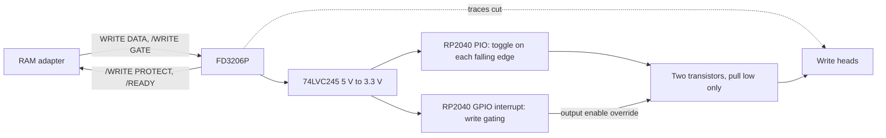

# fdswriteunlock

RP2040 firmware that takes over the write stage of a Famicom Disk System drive built on the Mitsumi FD3206P controller, so the drive can rewrite whole disks.

**TL;DR:** flash `fdswriteunlock.uf2` onto a Raspberry Pi Pico, cut two traces on the drive board, and wire eight signals through a 74LVC245 buffer and two transistors as described in [`docs/hardware.md`](docs/hardware.md). The RP2040's PIO switches the write heads in hardware, one to two PIO cycles after each data edge. The firmware passes 20 emulator tests that execute every firmware instruction. It has not yet run in a real drive.

## Why a drive refuses full-disk writes

Drives built from late 1988 use the FD3206P controller in place of the earlier FD7201P. The FD3206P lets the RAM adapter rewrite a single file but disconnects the write heads when it sees a write of the whole disk surface, and the RAM adapter reports error 26. FD7201P drives do not do this and do not need this firmware.

The board replaces the controller's write stage. Two cut traces separate the FD3206P from the write heads, and the RP2040 drives the heads from the same signals the controller receives.

## How it works



- **Data toggle, in PIO.** A four-instruction PIO program waits for each falling edge of WRITE DATA and swaps which head output is active, using side-set so the pin changes in the same cycle the wait ends. Input synchronisation is bypassed on that pin. The CPU is not involved.
- **Write gating, in an interrupt.** A highest-priority GPIO interrupt fires on any change of /WRITE GATE, /WRITE PROTECT or /READY. It enables the head outputs through the pad output-enable override only while all three are low. The main loop also forces that interrupt once per millisecond as a safety re-check.
- **Output stage.** Each head line is pulled low by an NPN transistor and is otherwise left to the drive's own pull-up, the way the original 74LS45 decoder drove it. With the RP2040 in reset or unpowered, the base pull-down resistors keep both heads released.
- **Supervision.** A 250 ms watchdog resets the chip if the main loop stops, which releases the heads.

| Measure | Value | Source |
|---|---|---|
| Data edge to head switch | 1 to 2 PIO cycles, 8 to 16 ns | RP2040 datasheet, input synchroniser bypassed. rp2040js resolves a PIO pin wait the instant the pin changes and reports 0 ns, so it cannot measure this |
| Gate change to heads released or engaged | 512 ns | emulator, 100 gate changes at random phase |
| Shortest data edge spacing handled | 4.7 us, the 10 percent fast limit | emulator, 1000 edges |

The drive records at 96.4 kHz, so a bit cell is 10.4 us. One PIO cycle of variation is 0.08 percent of a cell.

## Console

The console runs on USB CDC and on UART0 at 115200 baud, GP0 transmit and GP1 receive.

- At start-up it prints `fdswriteunlock ready, power-on start` or `fdswriteunlock ready, restarted by watchdog`.
- After each write it prints `write N: E edges in T us, R edges/s`, the average edge rate over the whole time the gate was open.
- Sending `s` prints `fdswriteunlock status: writing=yes|no writes=N edges=E`.

On macOS: `screen /dev/cu.usbmodem* 115200`. On Linux: `screen /dev/ttyACM0 115200`.

## Build

Requirements: CMake 3.20 or newer, Ninja, and an Arm GNU toolchain with newlib. CMake fetches pico-sdk 2.3.1 on first configure.

macOS:

```sh
brew install cmake ninja picotool
```

Then download the Arm GNU Toolchain for macOS from developer.arm.com, or install the `gcc-arm-embedded` cask, and point `PICO_TOOLCHAIN_PATH` at its `bin` folder. Homebrew's `arm-none-eabi-gcc` formula ships without newlib and cannot build the SDK.

Debian or Ubuntu:

```sh
sudo apt install gcc-arm-none-eabi libnewlib-arm-none-eabi libstdc++-arm-none-eabi-newlib cmake ninja-build
```

Build:

```sh
cmake -S . -B build -G Ninja -DCMAKE_BUILD_TYPE=Release
cmake --build build
```

The result is `build/fdswriteunlock.uf2`.

## Flash

1. Hold the BOOTSEL button on the Pico and plug it into USB. A drive named `RPI-RP2` appears.
2. Copy `build/fdswriteunlock.uf2` onto it. The Pico reboots into the firmware.

With picotool instead: `picotool load -x build/fdswriteunlock.uf2 -f`.

## Install

See [`docs/hardware.md`](docs/hardware.md) for the parts list, the wiring table and the install steps.

## Tests

The tests run the real firmware binary in the [rp2040js](https://github.com/wokwi/rp2040js) emulator. The harness steps the PIO once per CPU cycle, so the CPU, the PIO and the timers stay in lockstep.

```sh
cmake -S . -B build-emulator -G Ninja -DCMAKE_BUILD_TYPE=Release -DFDSWRITEUNLOCK_USB_CONSOLE=OFF
cmake --build build-emulator
cd test
pnpm install --frozen-lockfile
pnpm typecheck
pnpm test
```

Set `ARM_TOOLCHAIN_BIN` when `arm-none-eabi-objdump` is not on `PATH`.

Differences between the tested build and the shipped one:

- The emulator build turns off the USB console. The USB stack reads the flash unique ID through the boot ROM, and the boot ROM cannot be loaded into the emulator: part of it is licensed for use on RP2040 silicon only. The emulator starts the firmware from its own reset vector instead.
- rp2040js 1.4.0 never counts PWM input edges, because a `&&` stands where a `&` belongs in `RPPWM.gpioOnInput`. [`test/patches/rp2040js@1.4.0.patch`](test/patches/rp2040js@1.4.0.patch) fixes that one character.
- The harness refreshes every input after boot so the emulator's PWM input level matches the pin, as the real input synchroniser does.
- rp2040js keeps a software-pended hardware interrupt pending forever. The firmware requests its safety re-check through the IO bank force register instead, which behaves the same on silicon and in the emulator.

The last test fails if any instruction of the firmware sources never executes.

## Provenance

Written independently from public documentation. [`docs/clean-room.md`](docs/clean-room.md) lists the sources and the independence checks.

## License

MIT. See [`LICENSE`](LICENSE). pico-sdk is BSD-3-Clause and is fetched at build time, not stored here.
