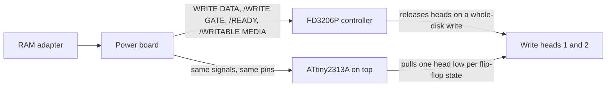

<div align="center">

<h1>fd3206-write-unlock</h1>

English | [日本語](README.ja.md) | [简体中文](README.zh-CN.md) | [繁體中文](README.zh-HK.md)

<br>

<strong>One ATtiny2313A soldered on top of the FD3206 controller, and a Famicom Disk System drive rewrites whole disks again.</strong>

<br>
<br>

[](https://github.com/gufranco/fd3206-write-unlock/actions/workflows/ci.yml)
[](https://github.com/gufranco/fd3206-write-unlock/releases/latest)
[](https://scorecard.dev/viewer/?uri=github.com/gufranco/fd3206-write-unlock)
[](https://github.com/gufranco/fd3206-write-unlock/actions/workflows/ci.yml)
[](LICENSE)

</div>

<p align="center">
  <a href="#install">Install</a> &nbsp;|&nbsp;
  <a href="#how-it-works">How it works</a> &nbsp;|&nbsp;
  <a href="#power-board">Power board</a> &nbsp;|&nbsp;
  <a href="https://github.com/gufranco/fd3206-write-unlock/releases">Releases</a> &nbsp;|&nbsp;
  <a href="#faq">FAQ</a>
</p>

<p align="center">
<b>8</b> solder points · <b>0</b> trace cuts · <b>0</b> extra parts · <b>230</b> bytes of flash · <b>15</b>-instruction edge handler · <b>0</b> MISRA C:2012 findings · <b>20</b> simulation scenarios
</p>

---

```text
ATtiny2313A, pin 1 over FD3206P pin 1
  solder  4 5 6 10 13 14 15 20
  clip    1 2 3 7 8 9 11 12 16 17 18 19
```

> [!IMPORTANT]
> The firmware passes every host, static and simulation gate, but it has not yet run in a real drive. Use a disk you do not care about for the first write.

<table>
<tr>
<td width="50%" valign="top">

**No cuts, no wires**<br>
Eight pins soldered straight onto the FD3206P. Nothing on the drive board is cut, and no resistor, jumper or second chip is added.

</td>
<td width="50%" valign="top">

**Pull low, never drive high**<br>
A head pin is an output at 0 or an input, so it cannot short against the FD3206P that shares it.

</td>
</tr>
<tr>
<td width="50%" valign="top">

**1.25 us to the head**<br>
A 15-instruction assembly interrupt moves the head 10 cycles after each WRITE DATA edge, well inside the 4.7 us shortest edge spacing.

</td>
<td width="50%" valign="top">

**Zero MISRA findings**<br>
C17 checked against MISRA C:2012 with assertions on and off, with every register access isolated in one assembly module.

</td>
</tr>
<tr>
<td width="50%" valign="top">

**Every instruction exercised**<br>
20 simavr scenarios run the release image of each chip and fail if any firmware instruction never executes; the logic is checked on all 65,536 port combinations.

</td>
<td width="50%" valign="top">

**The release is the tested binary**<br>
Each GitHub release attaches the exact hex the pipeline built and tested, with its SHA-256.

</td>
</tr>
</table>

## The problem

Drives built from late 1988 use the Mitsumi FD3206P controller in place of the earlier FD7201P. It lets the RAM adapter rewrite a single file, but it releases the write heads the moment a write covers the whole disk surface, and the RAM adapter reports error 26. Backing up or restoring a full disk on such a drive is impossible.

## The solution

The classic fix rebuilds the drive's write stage outside the controller: a flip-flop that toggles on every falling edge of WRITE DATA, and a gate that drives one head only while /READY, /WRITABLE MEDIA and /WRITE GATE are all low. This firmware is that write stage, in a chip that sits on the controller itself.

| | This firmware | GAL16V8 modchips | Classic wired mod |
|:--|:--:|:--:|:--:|
| Parts added | 1 chip | 1 chip | 74LS76 and 74LS45 |
| Trace cuts on the drive board | none | none | 2 |
| Extra wires | none | 1, pin 1 to pin 19 | several |
| Head pins | pull low only | driven both ways | open collector |
| Single-file saves while both write | cannot short | can drive against the controller | not affected, the controller is cut off |
| Source and tests | MIT, simulated, MISRA-clean | CUPL source for the open-source version | schematic |

## How it works



- **Edge interrupt.** WRITE DATA lands on pin 6, which is the ATtiny's INT0. A 15-instruction assembly handler writes the next head state to the port first, then swaps two precomputed values ready for the edge after. It touches no flags and no C state.
- **Gate.** The main loop samples the three conditions and services the watchdog in one call. When the conditions change it recomputes the two values the handler swaps, with interrupts off for the few instructions that takes.
- **Pull low, never drive high.** A head pin is either an output at 0 or an input. The drive's own pull-up resistors hold a released head high, which is what the original circuit's open-collector decoder did. The FD3206P shares these two pins, and a pin that only ever pulls low cannot short against it.
- **Pull-ups on every input.** WRITE DATA, /WRITE GATE, /WRITABLE MEDIA and /READY keep the chip's internal 20 to 50 kOhm pull-ups. The ATtiny needs 3.0 V to read a high where TTL chips need 2.0 V, and the pull-up lifts a weak TTL high toward 5 V. The power board already pulls /WRITE GATE up with 10 kOhm, so the lines are designed for it.
- **Watchdog.** 60 ms. A reset leaves every pin an input, which releases both heads.

Timing at 8 MHz:

| Measure | Value | Source |
|:--|:--|:--|
| Interrupt taken to head written | 10 cycles, 1.25 us | instruction count of the handler |
| Whole handler | about 30 cycles, 3.75 us | instruction count, under the 4.7 us shortest edge spacing |
| Variation between edges | up to 3 cycles, 375 ns, from the instruction in progress | AVR interrupt response, longest main-loop instruction `ret` |
| Gate change to heads released or engaged | 7.4 us at worst, 8.2 us at 7.2 MHz; limit 10 us | simulation, change swept across 64 main-loop phases |
| Same, while data edges arrive at the fastest rate | 19 us at worst, 23 us at 7.2 MHz; limit 100 us | simulation |
| Interrupts held off when the conditions change | 12 cycles at most, 1.5 us | instruction count of the update routine |
| Clock tolerance | every timing scenario passes at 7.2, 8.0 and 8.8 MHz | simulation at the internal oscillator's +/-10 percent |

The drive records at 96.4 kHz, a bit cell of 10.4 us. 375 ns of variation is 3.6 percent of a cell. A gate change falls inside a gap between blocks of at least 480 bits, so microseconds of gate delay only trim or extend that gap.

## Power board

A drive can have two write lockouts, and this chip removes only one.

| Board | What it does | Lockout | Fixed by |
|:--|:--|:--|:--|
| Drive mechanism, with the FD3206P or FD7201P controller | reads and writes the disk | FD3206P releases the heads on a whole-disk write; FD7201P has none | this chip, on FD3206P drives only |
| Power board | switches battery or adapter power to the motor and carries every signal between the RAM adapter connector and the drive mechanism | on FMD-POWER-04, -05, some -02 boards and the Twin Famicom AN-500, a circuit that blocks the write signal | the change in install step 2 |

A drive writes whole disks only when both lockouts are gone. An FD7201P drive needs no chip but can still need the power board change. An FD3206P drive with an FMD-POWER-01 board needs only the chip. The power board's circuit sits upstream on a different board, where no chip on the FD3206P can reach it.

## Install

### Step 1: identify the power board

1. Remove the six Phillips screws on the bottom of the unit.
2. Flip the unit and lift the top cover off carefully.
3. Remove the two Phillips screws holding the battery compartment and set it aside.
4. Remove the screws holding the power board and lift it out.
5. Turn it component side up and find the text `©198X Nintendo` and the code `FMD-POWER-XX`.

On a Sharp Twin Famicom skip the table and go to step 2d.

| Label | Protected | What to do |
|:--|:--:|:--|
| FMD-POWER-01 | no | nothing |
| FMD-POWER-02 without a green daughterboard | no | nothing |
| FMD-POWER-02 with a green daughterboard | yes, on the daughterboard | step 2a |
| FMD-POWER-03 | not documented; presumed like -02 | look for a daughterboard; if there is none and whole-disk writes still fail with the chip installed, suspect the board |
| FMD-POWER-04 | yes | step 2b |
| FMD-POWER-05 | yes | step 2c |

### Step 2: remove the power board lockout

The Famicom World article [FDS Power Board Modifications](https://famicomworld.com/workshop/tech/fds-power-board-modifications/) has a photo of each board with the exact points marked. The steps below say what each change is; the photos show where it lands on your board.

#### 2a. FMD-POWER-02 with daughterboard

1. Desolder the green daughterboard and remove it.
2. Clear the solder from the holes it leaves.
3. Desolder the drive connector from the daughterboard.
4. Fit that connector in the power board's own holes and solder it.

The board then matches the unprotected -02.

#### 2b. FMD-POWER-04

1. Remove the part labelled JP14, by desoldering it or cutting it out. This disables the protection circuit.
2. Join the points the article marks A and B with a short wire, or with a solder bridge if nothing else is close. This routes the write signal around the disabled circuit to the drive mechanism.

No trace is cut on this board.

#### 2c. FMD-POWER-05

1. Desolder the two jumper wires the article marks. One sits under the two black rectangular parts near the RAM adapter connection; bend those parts outward a little to reach it.
2. Cut the two traces the article marks in red. Check with a meter that no connection remains across either cut.
3. Solder the two wire links the article marks in blue. They route the write signals back to the drive mechanism.

#### 2d. Sharp Twin Famicom

The Twin Famicom has the same Mitsumi drive mechanism, with an FD7201P or an FD3206P, but its own Sharp power board, so the FMD-POWER table does not apply. Its lockout is removed with two wires instead of a board change.

1. Open the Twin Famicom and find the power board that the drive mechanism's cable runs through.
2. Find the two grey wires: one goes into the power board and the other comes out of it.
3. Disconnect or cut both from the power board.
4. Join the two grey wires to each other, solder the joint and insulate it with heat-shrink or tape. The write signal now runs straight past the board's protection circuit.

> [!WARNING]
> Wire colours are not guaranteed to match on every unit. Trace both wires to the power board before cutting anything.

Reports on the nesdev forum `(as of 2026-09)`:

| Model | Report |
|:--|:--|
| Twin Famicom, model not stated | Chris Covell reports the two-wire change worked, with a photo, 2014 |
| AN-500B, FD7201P drive | two owners, in 2014 and 2018, were told the two-wire change is the only one needed; neither posted a result |
| any Twin with an FD3206P drive | the FD3206P lockout remains after the two-wire change, so it also needs the chip |
| AN-505 | a post from 2026-09-03 relays a Discord discussion saying this model has no protection; not confirmed by a photo or a test |

### Step 3: program the chip

| Tool | Needed for | Install |
|:--|:--|:--|
| `avrdude` | writing fuses and flash | `brew install avrdude` on macOS, `apt install avrdude` on Debian |
| A USBasp, or an Arduino Uno or Nano running ArduinoISP | the programmer | load ArduinoISP from the Arduino IDE examples |
| Docker and Python 3 | only to build the firmware yourself | [docker.com](https://www.docker.com) |

Every [release](https://github.com/gufranco/fd3206-write-unlock/releases) attaches one image per chip, `fd3206-write-unlock-attiny2313a.hex` and `fd3206-write-unlock-attiny4313.hex`, each exactly as the pipeline built and tested it, with its SHA-256:

```sh
sha256sum -c fd3206-write-unlock-attiny2313a.hex.sha256
make fuses PROGRAMMER=usbasp
avrdude -c usbasp -p t2313a -U flash:w:fd3206-write-unlock-attiny2313a.hex:i
```

To build the same image yourself, `make` builds it in a pinned Docker toolchain and `make flash PROGRAMMER=usbasp` writes it. With an Arduino as the programmer, pass `PROGRAMMER=arduino_as_isp PORT=/dev/cu.usbmodemXXXX`. For an ATtiny4313, add `MCU=attiny4313` to both `make fuses` and `make flash`, or give avrdude `-p t4313` and the ATtiny4313 image.

The fuses are low `0xE4`, 8 MHz internal oscillator with no clock output, and high `0xD9`, brown-out reset at 4.3 V with programming left enabled. A new chip runs its 4 MHz oscillator divided by 8; the firmware sets the prescaler to 1 at start-up, so an unfused chip still works at 4 MHz, with twice the edge variation and no brown-out protection.

### Step 4: install the chip, FD3206P drives only

The ATtiny4313 has the same pinout. It takes its own image, because its larger RAM moves the top of the stack.

| ATtiny2313A pin | FD3206P signal | Action |
|:--|:--|:--:|
| 4, PA1 | /WRITE GATE | solder |
| 5, PA0 | /WRITABLE MEDIA | solder |
| 6, PD2 INT0 | WRITE DATA | solder |
| 10 | GND | solder |
| 13, PB1 | /READY | solder |
| 14, PB2 | Head 2 | solder |
| 15, PB3 | Head 1 | solder |
| 20 | +5 V | solder |
| 1, 2, 3, 7, 8, 9, 11, 12, 16, 17, 18, 19 | not documented | clip |

Famicom World's photos label pin 5 /WRITE PROTECT. The power board and the RAM adapter call the signal /writable media: low means the disk can be written, which is when the firmware may drive a head.

Before installing, measure on the drive with a multimeter, with no disk inserted:

1. Power on, chip not installed: pins 14 and 15 idle at 5.5 V or less. The FMD-POWER-05 schematic shows only 5 V rails reaching the drive board, so about 5 V is expected; more would exceed the ATtiny's pin rating.
2. Power on, chip not installed: clip a 1 kOhm resistor from pin 14 to GND with hook probes and read the voltage V on pin 14; repeat on pin 15. With V0 the idle voltage from step 1, the pin's source resistance is 1000 x (V0 - V) / V ohms. It must be at least 250 Ohm, so a head the ATtiny pulls low carries at most 20 mA, whether a resistor on the drive board or the FD3206P itself holds the line high. Below 250 Ohm, do not install. Leave the resistor on for a few seconds only: it may switch the head on, which is why no disk may be inserted.
3. After installing, during a write on a disk you can lose: the pin pulled low reads 0.8 V or less, the ATtiny's rated low level at 20 mA.

1. Bend or clip the pins marked "clip" so they cannot touch the FD3206P. Their counterparts are signals nobody has documented, and the firmware never needs them.
2. Lift out the drive mechanism and remove its bottom plate to reach the controller board.
3. Place the ATtiny on the FD3206P with pin 1 over pin 1. Both notches face the same way.
4. Solder the eight pins marked "solder" to the FD3206P pins underneath.
5. With the power off, check with the meter that no two neighbouring pins are joined and that pin 20 is not shorted to pin 10. A solder bridge on the FD3206P, which cannot be replaced, is the most likely way to damage the drive.
6. Refit the bottom plate with tape over the area above the chips.

### Step 5: test on the drive

Use a disk you can lose, and back up any disk before writing to it.

1. Save a game. This is the case the FD3206P also writes; see [One thing it does not handle](#one-thing-it-does-not-handle).
2. Rewrite a whole disk with a disk-writing tool, then read it back several times.
3. With a logic analyzer, compare WRITE DATA on pin 6 with pins 14 and 15. Each falling edge moves the low level from one pin to the other.

If whole-disk writes still fail, check that WRITE DATA and /WRITE GATE reach FD3206P pins 6 and 4 during the write. If they do not, the power board is still blocking the write signal upstream of the chip.

## Behaviour

Each requirement is verified by a simulation scenario that runs the release firmware image of each chip at 7.2, 8.0 and 8.8 MHz. The gating and head selection are also checked for all 65,536 input port combinations.

| Requirement | Scenario |
|:--|:--|
| Both head pins MUST be inputs unless /READY, /WRITABLE MEDIA and /WRITE GATE are all low | one condition high, 100 falling edges: both heads released after every edge |
| While writing, exactly one head pin MUST be low, and it MUST change on every falling edge of WRITE DATA | 1000 edges 4.7 us apart: one head low after every edge, the other one each time |
| A rising edge of WRITE DATA MUST NOT change the heads | 1 us low pulse: the heads change once, at the fall |
| The head a write starts on MUST follow the count of falling edges, as the classic flip-flop does, even while the heads are released | 100 or 101 edges with the gate closed, then the gate opens: head 1 after an even count, head 2 after an odd one |
| Holding WRITE DATA low MUST NOT change the heads again | 20 us low: the heads change once, at the fall |
| An edge arriving while the gate opens MUST NOT be lost | an edge at each of 96 cycle offsets after the gate opens: the head after it always matches the edge count |
| The heads MUST be released within 10 us of any condition going high | each condition in turn, no further edges: both released within 10 us |
| Exactly one head MUST be driven within 10 us of all conditions becoming low | /WRITE GATE falls with the others low: one head low within 10 us |
| The heads MUST end released after a write gate glitch | 250 ns gate pulse: both released afterwards |
| After start-up no pin SHALL be an output, every input SHALL have its pull-up and no head pin SHALL | all inputs high: every direction register zero, pull-ups on the four inputs, none on the heads |
| The heads MUST be released within 100 us of /WRITE GATE going high while data edges arrive at the fastest rate | fastest data, gate closes: released within 100 us and for the next 100 edges |
| Exactly one head MUST be driven within 100 us of /WRITE GATE going low while data edges arrive at the fastest rate | fastest data, gate opens: one head low within 100 us, alternating on every edge after |
| The firmware MUST run undivided from its clock and keep the watchdog armed | a chip that starts divided by 8, after start-up: prescaler 1, watchdog enabled with its 60 ms timeout |
| The watchdog MUST NOT fire during normal operation | 600 ms of edges, ten times the timeout: no reset, one head low after every edge |
| A hung main loop MUST be reset by the watchdog, and writing MUST resume | the loop stops for 100 ms: one watchdog reset, then one head low and alternating on the next 100 edges |

## One thing it does not handle

On single-file saves the FD3206P still writes, on the same two pins, from its own flip-flop, while the ATtiny drives them from its own. If the two disagree, both heads are pulled low at once and that save is written wrong. No-wire modchips that leave the FD3206P connected are sold for this drive, and one vendor states its chip works like an unrestricted FD7201; that is evidence the two flip-flops stay in step in practice. This firmware keeps the GAL modchip's phase exactly: it starts at 0, drives head 1 first and toggles on every falling edge. One difference remains. A GAL also drives its pins high and could overpower the controller when they disagree, while the ATtiny only pulls low and cannot. The classic two-chip mod is no evidence either way, because it cuts the traces between the FD3206P and the heads. A save on a real drive, on a disk you can lose, settles it; the fix that removes the question for certain is those two trace cuts, which this project deliberately does not require.

## Figures

<!-- figures:begin -->
| Figure | Value |
|---|---|
| Flash used | 230 bytes |
| Edge handler | 15 instructions |
| Firmware source | 189 non-blank lines |
<!-- figures:end -->

Measured from the release build.

## FAQ

<details>
<summary><strong>Does my drive need this?</strong></summary>
<br>

Only if its controller is the FD3206P. Open the drive mechanism and read the large chip on the controller board. An FD7201P has no controller lockout, although its power board may still need the change in install step 2.

</details>

<details>
<summary><strong>Why not an ATtiny85 or another 8-pin part?</strong></summary>
<br>

The write stage needs six I/O pins: WRITE DATA, three conditions and two heads. An 8-pin ATtiny has five without giving up RESET, and giving up RESET ends in-system programming. Only the x313 also puts GND, VCC and INT0 exactly where the FD3206P has GND, +5 V and WRITE DATA, which is what makes a piggyback install possible.

</details>

<details>
<summary><strong>What are the two lifted pins on the "V4" modchip?</strong></summary>
<br>

Pin 1 and pin 19, joined by a wire. A GAL16V8 in registered mode clocks its flip-flop only from pin 1, on a rising edge, while the drive toggles on the falling edge of WRITE DATA, so the GAL inverts WRITE DATA onto output pin 19 and loops it back into its own clock pin. Neither is a reset. The commercial "FD3206 Add-On Chip V4" is sold with its markings removed and its install photo shows that same jumper, so it is most likely the same GAL design; that is an inference from the photo. The ATtiny needs no loop: INT0 triggers on the falling edge directly.

</details>

<details>
<summary><strong>Can I build it with the Arduino IDE?</strong></summary>
<br>

No. The Arduino IDE only programs the Arduino that acts as the ISP programmer. The firmware is built in a pinned toolchain so that every chip receives the image that passed the MISRA check, the tests and the simulation.

</details>

<details>
<summary><strong>Does it work in a Sharp Twin Famicom?</strong></summary>
<br>

The Twin Famicom uses the same Mitsumi drive mechanism, so an FD3206P unit takes the chip the same way. Its power board has its own lockout, removed by joining two grey wires; see install step 2d.

</details>

## Versioning

Releases follow [Semantic Versioning](https://semver.org/) and are cut automatically from `main` after the pipeline passes. Every [release](https://github.com/gufranco/fd3206-write-unlock/releases) carries its notes, the firmware hex of each chip with its SHA-256, the Sigstore bundle of its signed build provenance and an SPDX software bill of materials attested to both images. Provenance comes from GitHub-hosted runners through the release workflow, which meets SLSA Build Level 2. Verify a download with:

```sh
gh attestation verify fd3206-write-unlock-attiny2313a.hex --repo gufranco/fd3206-write-unlock
```

## Support

| Need | Where |
|:--|:--|
| Bug report or hardware result | [GitHub Issues](https://github.com/gufranco/fd3206-write-unlock/issues) |
| Security report | [Security policy](SECURITY.md) |

## Provenance

Written independently from public documentation. Only these sources informed the code and this README:

| Source | Facts taken |
|:--|:--|
| Famicom World, "[Famicom Disk System FD3206 Write Mod](https://famicomworld.com/workshop/tech/famicom-disk-system-fd3206-write-mod/)" | FD3206P pads for +5 V, GND, /READY, /WRITE GATE, /WRITABLE MEDIA, WRITE DATA from its labelled board photos, where pin 5 reads /WRITE PROTECT; head traces at pins 14 and 15; head drive behaviour of its 74LS76 and 74LS45 schematic |
| Famicom World, "[FDS Power Board Modifications](https://famicomworld.com/workshop/tech/fds-power-board-modifications/)" | Which power board revisions carry a write lockout and how each is removed |
| nesdev forum threads [11342](https://forums.nesdev.org/viewtopic.php?t=11342), [17037](https://forums.nesdev.org/viewtopic.php?t=17037), [19856](https://forums.nesdev.org/viewtopic.php?t=19856) and "[Disable copy protection on the Twin Famicom AN-505BK](https://forums.nesdev.org/viewtopic.php?p=310336)" | The Twin Famicom power board change and per-model reports |
| Brad Taylor, "[Famicom Disk System technical reference](https://www.nesdev.org/FDS%20technical%20reference.txt)", nesdev.org | 96.4 kHz bit rate, 10 percent tolerance, 1 us pulses, signal names |
| nesdev wiki, "[FDS RAM adaptor cable pinout](https://www.nesdev.org/wiki/FDS_RAM_adaptor_cable_pinout)" and "[FDS disk format](https://www.nesdev.org/wiki/FDS_disk_format)" | Signal names and polarities, gap lengths |
| Microchip document 8246, [ATtiny2313A/4313](https://ww1.microchip.com/downloads/en/DeviceDoc/doc8246.pdf) | Pinout, input and output levels, interrupts, timed watchdog and prescaler sequences, oscillator accuracy, supply range, pin current |
| nesdev forum, [FMD-POWER-05](https://forums.nesdev.org/viewtopic.php?t=17881) reverse-engineered schematic | Only +5 V and the +5 V motor rail reach the drive board; a 10 kOhm pull-up on /write; the signal name /writable media |
| [avrdude 8](https://github.com/avrdudes/avrdude/blob/main/src/avrdude.conf.in) part database | Fuse bit meanings and factory values |
| [FDSStick](https://www.fdsstick.com/the-latest-fd3206-modchip-v4-no-need-any-wires/) and [ToToTEK](https://www.tototek.com/store/index.php?main_page=product_info&products_id=228) product pages for the FD3206 V4 add-on chip | Install photo showing eight soldered pins and a pin 1 to pin 19 jumper, for the comparison only |

[Stephen-Arsenault/FDS-FD3206-Modchip](https://github.com/Stephen-Arsenault/FDS-FD3206-Modchip), CC BY-SA 4.0, puts a programmable logic device on the same controller. No file, source text, photo, documentation text or name from it appears here, and the controller pin numbers were confirmed against the Famicom World board photos, not taken from it. The function is the same because it is the drive's function; the expression differs: the GAL is combinational logic and a register clocked through a wire loop, this is a C main loop and an assembly interrupt that swaps two precomputed port values and drives the pins open-drain. No block of four or more lines matches, and the firmware contains no third-party code.

## License

[MIT](LICENSE)
