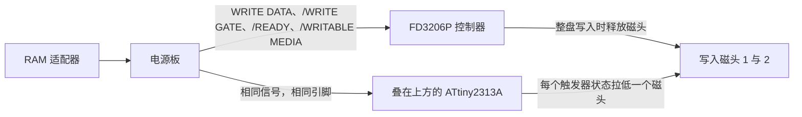

<div align="center">

<h1>fd3206-write-unlock</h1>

[English](README.md) | [日本語](README.ja.md) | 简体中文 | [繁體中文](README.zh-HK.md)

<br>

<strong>在 FD3206 控制器上方焊一颗 ATtiny2313A，Famicom 磁碟机的驱动器就能重新改写整张磁盘。</strong>

<br>
<br>

[](https://github.com/gufranco/fd3206-write-unlock/actions/workflows/ci.yml)
[](https://github.com/gufranco/fd3206-write-unlock/releases/latest)
[](https://scorecard.dev/viewer/?uri=github.com/gufranco/fd3206-write-unlock)
[](https://github.com/gufranco/fd3206-write-unlock/actions/workflows/ci.yml)
[](LICENSE)

</div>

<p align="center">
  <a href="#安装">安装</a> &nbsp;|&nbsp;
  <a href="#工作原理">工作原理</a> &nbsp;|&nbsp;
  <a href="#电源板">电源板</a> &nbsp;|&nbsp;
  <a href="https://github.com/gufranco/fd3206-write-unlock/releases">发布版本</a> &nbsp;|&nbsp;
  <a href="#常见问题">常见问题</a>
</p>

<p align="center">
<b>8</b> 个焊点 · <b>0</b> 处切线 · <b>0</b> 个额外元件 · <b>230</b> 字节闪存 · <b>15</b> 条指令的边沿中断 · <b>0</b> 项 MISRA C:2012 问题 · <b>16</b> 个仿真场景
</p>

---

```text
ATtiny2313A, pin 1 over FD3206P pin 1
  solder  4 5 6 10 13 14 15 20
  clip    1 2 3 7 8 9 11 12 16 17 18 19
```

> [!IMPORTANT]
> 固件已通过主机测试、静态分析和仿真的全部检查，但尚未在真实驱动器上运行过。第一次写入请使用坏了也无所谓的磁盘。

<table>
<tr>
<td width="50%" valign="top">

**不切线，不加线**<br>
只需把 8 个引脚直接焊在 FD3206P 上。驱动器电路板不切断任何线路，也不添加电阻、跳线或第二颗芯片。

</td>
<td width="50%" valign="top">

**只拉低，不驱动为高**<br>
磁头引脚要么输出 0，要么为输入，因此不会与共用该引脚的 FD3206P 短路。

</td>
</tr>
<tr>
<td width="50%" valign="top">

**1.25 us 切换磁头**<br>
15 条指令的汇编中断在 WRITE DATA 每个边沿后 10 个周期切换磁头，远低于 4.7 us 的最短边沿间隔。

</td>
<td width="50%" valign="top">

**零 MISRA 问题**<br>
C17 代码在启用和关闭断言时均按 MISRA C:2012 检查，所有寄存器访问都隔离在一个汇编模块中。

</td>
</tr>
<tr>
<td width="50%" valign="top">

**每条指令都被执行**<br>
16 个 simavr 场景运行每种芯片的正式版映像，只要有一条固件指令未被执行就判为失败；逻辑还针对全部 65,536 种端口组合进行了检查。

</td>
<td width="50%" valign="top">

**发布的就是测试过的二进制**<br>
每个 GitHub 发布版本都附有流水线构建并测试过的同一个 hex 及其 SHA-256。

</td>
</tr>
</table>

## 问题

1988 年末以后生产的驱动器用三美 FD3206P 控制器取代了早期的 FD7201P。它允许 RAM 适配器改写单个文件，但写入一旦覆盖整个盘面，就会立即释放写入磁头，RAM 适配器随即报告错误 26。在这样的驱动器上，无法备份或恢复整张磁盘。

## 解决方案

经典做法是在控制器之外重建驱动器的写入级：一个在 WRITE DATA 每个下降沿翻转的触发器，以及一个只在 /READY、/WRITABLE MEDIA 和 /WRITE GATE 全为低电平时才驱动一个磁头的门控。本固件就是这个写入级，放在叠焊于控制器之上的芯片里。

| | 本固件 | GAL16V8 改造芯片 | 经典接线改造 |
|:--|:--:|:--:|:--:|
| 新增元件 | 1 颗芯片 | 1 颗芯片 | 74LS76 与 74LS45 |
| 驱动器电路板切线 | 无 | 无 | 2 处 |
| 额外连线 | 无 | 1 根，1 脚到 19 脚 | 多根 |
| 磁头引脚 | 只拉低 | 双向驱动 | 集电极开路 |
| 两者同时写入的单文件存档 | 不会短路 | 可能与控制器对冲 | 不受影响，控制器已被断开 |
| 源代码与测试 | MIT，经过仿真，符合 MISRA | 开源版本提供 CUPL 源代码 | 原理图 |

## 工作原理



与经典写入改造的逻辑相同：一个在 WRITE DATA 每个下降沿翻转状态的触发器，以及一个只在 /READY、/WRITABLE MEDIA 和 /WRITE GATE 全为低电平时才允许驱动一个磁头的门控。

- **边沿中断。** WRITE DATA 接到 6 脚，即 ATtiny 的 INT0。一段 15 条指令的汇编处理程序先把下一个磁头状态写入端口，再交换两个为下一个边沿预先算好的值。它不改动标志位，也不触及 C 代码的状态。
- **门控。** 主循环通过一次调用读取三个条件并喂看门狗。条件变化时，重新计算中断处理程序要交换的两个值，并在这几条指令期间关闭中断。
- **只拉低，从不驱动为高。** 磁头引脚要么是输出 0，要么是输入。被释放的磁头由驱动器自身的上拉电阻保持高电平，这与原电路中集电极开路的译码器行为一致。FD3206P 与这两个引脚共用，而只会拉低的引脚不会与它短路。
- **所有输入都有上拉。** WRITE DATA、/WRITE GATE、/WRITABLE MEDIA 和 /READY 使用芯片内部 20 至 50 kΩ 的上拉。ATtiny 需要 3.0 V 才能读为高电平，高于 TTL 的 2.0 V，上拉可以把偏弱的 TTL 高电平抬向 5 V。电源板本身已用 10 kΩ 上拉 /WRITE GATE，这些信号线本就按此设计。
- **看门狗。** 60 ms。复位后所有引脚都变为输入，两个磁头都被释放。

8 MHz 下的时序：

| 项目 | 数值 | 依据 |
|---|---|---|
| 从响应中断到写入磁头 | 10 个周期，1.25 us | 处理程序的指令计数 |
| 整个处理程序 | 约 30 个周期，3.75 us | 指令计数，低于 4.7 us 的最短边沿间隔 |
| 各边沿之间的抖动 | 视正在执行的指令而定，最多 3 个周期，375 ns | AVR 中断响应，主循环中最长的指令是 `ret` |
| 从门控变化到磁头释放或接通 | 最坏 7.4 us，7.2 MHz 时 8.2 us，上限 10 us | 仿真，在主循环的 64 个相位上施加变化测得 |
| 同上，期间数据边沿以最快速率到达 | 最坏 19 us，7.2 MHz 时 23 us，上限 100 us | 仿真 |
| 条件变化时关闭中断的时间 | 最多 12 个周期，1.5 us | 更新程序的指令计数 |
| 时钟容差 | 所有时序场景在 7.2、8.0 和 8.8 MHz 下均通过 | 以内部振荡器 ±10% 的频率仿真 |

驱动器以 96.4 kHz 记录，每位 10.4 us。375 ns 的抖动是一位的 3.6%。门控变化发生在块与块之间至少 480 位的间隙内，因此几微秒的门控延迟只会让间隙略短或略长。

## 电源板

驱动器，即 HVC-022 或夏普 Twin Famicom 内置的驱动器，内有两块电路板：

| 电路板 | 作用 | 写入锁定 | 解除方式 |
|---|---|---|---|
| 驱动机构，搭载 FD3206P 或 FD7201P 控制器 | 读写磁盘 | FD3206P 在整盘写入时释放磁头；FD7201P 没有锁定 | 本芯片，仅限 FD3206P 驱动器 |
| 电源板 | 将电池或电源适配器的电力切换给马达，并在 RAM 适配器接口与驱动机构之间传递全部信号 | FMD-POWER-04、-05、部分 -02 及 Twin Famicom AN-500 上有阻断写入信号的电路 | 第 2 步的电源板改造 |

只有两处锁定都解除后，驱动器才能整盘写入。FD7201P 驱动器不需要芯片，但仍可能需要改造电源板。配备 FMD-POWER-01 电源板的 FD3206P 驱动器只需要芯片。本项目"不切断线路"的原则只针对驱动机构电路板；电源板的锁定电路位于另一块电路板的上游，叠放在 FD3206P 上的芯片无法触及。

## 安装

### 第 1 步：确认电源板版本

1. 拧下主机底部的 6 颗十字螺丝。
2. 将主机翻过来，小心取下上盖。
3. 拧下固定电池盒的 2 颗十字螺丝，把电池盒移到一旁。
4. 拧下固定电源板的螺丝，取出电源板。
5. 将元件面朝上，找到 `©198X Nintendo` 字样和 `FMD-POWER-XX` 型号。

如果是夏普 Twin Famicom，请跳过下表，直接进行第 2d 步。

| 型号 | 锁定电路 | 操作 |
|---|---|---|
| FMD-POWER-01 | 无 | 无需操作 |
| FMD-POWER-02，无绿色子板 | 无 | 无需操作 |
| FMD-POWER-02，有绿色子板 | 有，在子板上 | 第 2a 步 |
| FMD-POWER-03 | 无资料，推测与 -02 相同 | 检查是否有子板；若没有子板，而装上芯片后整盘写入仍失败，则怀疑是这块电源板 |
| FMD-POWER-04 | 有 | 第 2b 步 |
| FMD-POWER-05 | 有 | 第 2c 步 |

### 第 2 步：解除电源板的写入锁定

Famicom World 的文章 [FDS Power Board Modifications](https://famicomworld.com/workshop/tech/fds-power-board-modifications/) 提供了每种电路板的照片，并标出了准确的操作位置。以下步骤说明每项改动的内容；具体在您的电路板上的位置请参照文章中的照片。

#### 2a. 带子板的 FMD-POWER-02

1. 拆焊并取下绿色子板。
2. 清除留下的孔中的焊锡。
3. 从子板上拆焊驱动器接插件。
4. 将该接插件装入电源板原有的孔位并焊好。

完成后，电路板与无锁定的 -02 相同。

#### 2b. FMD-POWER-04

1. 拆焊或剪掉标有 JP14 的元件。这会使锁定电路失效。
2. 用一段短导线连接文章中标为 A 和 B 的两点；如果周围没有其他元件，也可以用焊锡桥接。这样写入信号就能绕过已失效的电路到达驱动机构。

这块电路板无需切断铜箔。

#### 2c. FMD-POWER-05

1. 拆焊文章中标出的两根跳线。其中一根位于 RAM 适配器连接处附近两个黑色方形元件的下方；把这两个元件向外轻轻扳开即可够到。
2. 切断文章中用红色标出的两条铜箔。用万用表确认切口两侧已完全不导通。
3. 焊上文章中用蓝色标出的两条连线。它们把写入信号重新送回驱动机构。

#### 2d. 夏普 Twin Famicom

Twin Famicom 使用相同的三美驱动机构，搭载 FD7201P 或 FD3206P，但电源板是夏普自己的设计，因此 FMD-POWER 表不适用。它的锁定通过两根导线解除，而不需要改造电路板。

1. 打开 Twin Famicom，找到驱动机构的线缆所经过的电源板。
2. 找到两根灰色导线：一根进入电源板，另一根从电源板引出。
3. 将两根线从电源板上拔下或剪断。
4. 把两根灰色导线互相连接，焊牢后用热缩管或胶带绝缘。这样写入信号会直接绕过电路板上的锁定电路。

并非每台机器的导线颜色都相同；剪线之前，请先把两根线都追踪到电源板上确认。nesdev 论坛上的报告 `(截至 2026-09)`：

| 机型 | 报告 |
|---|---|
| Twin Famicom，未注明机型 | Chris Covell 于 2014 年附照片报告，两根导线的改造有效 |
| AN-500B，FD7201P 驱动器 | 2014 年和 2018 年各有一位机主被告知只需两根导线的改造；两人都未发布结果 |
| 所有搭载 FD3206P 驱动器的 Twin Famicom | 两根导线改造后 FD3206P 的锁定仍在，因此还需要本芯片 |
| AN-505 | 2026-09-03 的一篇帖子转述了 Discord 上的讨论，称该机型没有锁定；没有照片或测试佐证 |

### 第 3 步：烧录芯片

| 工具 | 用途 | 获取方式 |
|:--|:--|:--|
| `avrdude` | 写入熔丝和闪存 | macOS 上 `brew install avrdude`，Debian 上 `apt install avrdude` |
| USBasp，或运行 ArduinoISP 的 Arduino Uno 或 Nano | 编程器 | 从 Arduino IDE 示例中烧录 ArduinoISP |
| Docker 与 Python 3 | 仅在自行构建固件时需要 | [docker.com](https://www.docker.com) |

每个[发布版本](https://github.com/gufranco/fd3206-write-unlock/releases)都为每种芯片附有一个映像，即 `fd3206-write-unlock-attiny2313a.hex` 和 `fd3206-write-unlock-attiny4313.hex`，均为流水线构建并测试过的原样映像，并附各自的 SHA-256：

```sh
sha256sum -c fd3206-write-unlock-attiny2313a.hex.sha256
make fuses PROGRAMMER=usbasp
avrdude -c usbasp -p t2313a -U flash:w:fd3206-write-unlock-attiny2313a.hex:i
```

如需自行构建同一映像，`make` 会在版本固定的 Docker 工具链中构建，`make flash PROGRAMMER=usbasp` 负责烧录。用 Arduino 作编程器时，指定 `PROGRAMMER=arduino_as_isp PORT=/dev/cu.usbmodemXXXX`。使用 ATtiny4313 时，在 `make fuses` 和 `make flash` 后都加上 `MCU=attiny4313`，或向 avrdude 传入 `-p t4313` 和 ATtiny4313 的映像。

熔丝设置为：低位 `0xE4`，内部 8 MHz 振荡器，无时钟输出；高位 `0xD9`，4.3 V 掉电复位，保留编程功能。新芯片以 8 分频的 4 MHz 振荡器运行；固件在启动时把分频系数设为 1，因此未设置熔丝的芯片也能以 4 MHz 工作，但边沿抖动会加倍，且没有掉电保护。

### 第 4 步：安装芯片，仅限 FD3206P 驱动器

驱动机构上唯一新增的元件，就是焊在 FD3206P 上方、已烧录好的 ATtiny2313A。这块电路板上不切断任何线路，也不添加导线。ATtiny4313 引脚排列相同，但其 RAM 更大，栈顶位置不同，因此需使用它自己的映像。

| ATtiny2313A 引脚 | FD3206P 信号 | 操作 |
|---|---|---|
| 4，PA1 | /WRITE GATE | 焊接 |
| 5，PA0 | /WRITABLE MEDIA | 焊接 |
| 6，PD2 INT0 | WRITE DATA | 焊接 |
| 10 | GND | 焊接 |
| 13，PB1 | /READY | 焊接 |
| 14，PB2 | 磁头 2 | 焊接 |
| 15，PB3 | 磁头 1 | 焊接 |
| 20 | +5 V | 焊接 |
| 1、2、3、7、8、9、11、12、16、17、18、19 | 无资料 | 剪掉，确保不接触任何地方 |

Famicom World 的照片把 5 脚标为 /WRITE PROTECT。电源板和 RAM 适配器把这个信号称为 /writable media：低电平表示磁盘可以写入，固件只在这时才可以驱动磁头。

安装之前，请用万用表在驱动器上测量：

1. 通电、未装芯片：14 脚和 15 脚待机时不高于 5.5 V。FMD-POWER-05 原理图显示送到驱动板的只有 5 V 电源，因此应约为 5 V；更高会超出 ATtiny 引脚的额定值。
2. 断电：14 脚和 15 脚各自到 +5 V 的电阻不小于 250 Ω，这样磁头被拉低时不超过 ATtiny 每个引脚 20 mA 的额定值。FD3206P 驱动同一磁头时会分担电流。
3. 安装后、写入期间：被拉低的引脚不高于 0.8 V，即 ATtiny 在 20 mA 时的额定低电平。

1. 将标为"剪掉"的引脚弯开或剪掉，使其无法接触 FD3206P。FD3206P 上对应的引脚是无人记录过的信号，固件也用不到。
2. 取出驱动机构，拆下底板，露出控制器电路板。
3. 把 ATtiny 以 1 脚对 1 脚的方式放在 FD3206P 上，两颗芯片的缺口朝向一致。
4. 把标为"焊接"的 8 个引脚焊到正下方的 FD3206P 引脚上。
5. 在芯片上方对应的位置贴上胶带，再装回底板。

### 第 5 步：在驱动器上测试

请使用一张坏了也无所谓的磁盘。

1. 保存一次游戏进度。这是 FD3206P 也会写入的情况，参见"尚未解决的一点"一节。
2. 用磁盘写入工具改写整张磁盘，然后反复读取几次。
3. 用逻辑分析仪比较 6 脚的 WRITE DATA 与 14、15 脚。每个下降沿都会使低电平从一个引脚移到另一个引脚。

如果整盘写入仍然失败，请检查写入期间 WRITE DATA 和 /WRITE GATE 是否到达 FD3206P 的 6 脚和 4 脚。如果没有到达，说明电源板仍在芯片上游阻断写入信号。

## 行为要求

每条要求都由一个在 7.2、8.0 和 8.8 MHz 下运行每种芯片正式版固件映像的仿真场景验证。门控与磁头选择还针对输入端口全部 65,536 种组合进行了检查。

| 要求 | 场景 |
|---|---|
| 除非 /READY、/WRITABLE MEDIA 和 /WRITE GATE 全为低电平，否则两个磁头引脚都必须为输入 | 一个条件为高，100 个下降沿：每个边沿后两个磁头均被释放 |
| 写入期间必须恰好有一个磁头引脚为低，且在 WRITE DATA 的每个下降沿都必须切换 | 间隔 4.7 us 的 1000 个边沿：每个边沿后只有一个为低，且每次换到另一个 |
| WRITE DATA 的上升沿不得改变磁头 | 1 us 的低电平脉冲：磁头只在下降沿变化一次 |
| 任一条件变高后 10 us 内必须释放磁头 | 依次测试每个条件，之后无边沿：10 us 内两个均被释放 |
| 所有条件变低后 10 us 内必须恰好驱动一个磁头 | 其他条件为低时 /WRITE GATE 下降：10 us 内一个为低 |
| 写入门控出现毛刺后，磁头必须最终处于释放状态 | 250 ns 的门控脉冲：之后两个均被释放 |
| 启动后不得有任何引脚为输出，每个输入都必须有上拉，磁头引脚不得有上拉 | 所有输入为高：方向寄存器全为零，四个输入有上拉，磁头没有 |
| 数据边沿以最快速率到达期间，/WRITE GATE 变高后 100 us 内必须释放磁头 | 最快数据中关闭门控：100 us 内释放，之后 100 个边沿保持释放 |
| 数据边沿以最快速率到达期间，/WRITE GATE 变低后 100 us 内必须恰好驱动一个磁头 | 最快数据中打开门控：100 us 内一个为低，之后每个边沿切换 |
| 固件必须以不分频的时钟运行，并保持看门狗启用 | 启动后：分频系数 1，看门狗已启用 |
| 正常工作期间看门狗不得触发 | 600 ms 的边沿，相当于超时时间的 10 倍：无复位，每个边沿后只有一个为低 |

## 尚未解决的一点

保存单个文件时，FD3206P 仍会用自己的触发器驱动同样的两个引脚进行写入。如果两个触发器的状态不一致，两个磁头会同时被拉低。叠放在这颗芯片上的经典 GAL 改造芯片也有同样的问题，而且还会把引脚驱动为高电平；本固件至少不会与控制器短路。存档是否受影响，只能在真实驱动器上确认。能彻底消除这一问题的，是经典接线改造中切断两条铜箔的做法，而本项目刻意不要求这样做。

## 数据

<!-- figures:begin -->
| 项目 | 数值 |
|---|---|
| 闪存占用 | 230 字节 |
| 边沿中断处理程序 | 15 条指令 |
| 固件源代码 | 非空行 189 行 |
<!-- figures:end -->

数值取自正式版构建。

## 常见问题

<details>
<summary><strong>我的驱动器需要它吗？</strong></summary>
<br>

只有控制器是 FD3206P 时才需要。打开驱动机构，查看控制器电路板上那颗大芯片的型号。FD7201P 没有控制器锁定，但其电源板仍可能需要安装第 2 步的改造。

</details>

<details>
<summary><strong>为什么不用 ATtiny85 等 8 脚芯片？</strong></summary>
<br>

写入级需要 6 个 I/O：WRITE DATA、三个条件和两个磁头。8 脚的 ATtiny 在不放弃 RESET 的情况下只有 5 个，而放弃 RESET 就无法在线编程。此外只有 x313 的 GND、VCC 和 INT0 恰好位于 FD3206P 的 GND、+5 V 和 WRITE DATA 的位置，这正是能够叠焊安装的原因。

</details>

<details>
<summary><strong>"V4" 改造芯片上翘起的两个引脚是什么？</strong></summary>
<br>

是 1 脚和 19 脚，用一根导线相连。寄存器模式下的 GAL16V8 只能从 1 脚的上升沿获取触发器时钟，而驱动器在 WRITE DATA 的下降沿翻转，因此 GAL 把 WRITE DATA 反相后从输出脚 19 送出，再接回自己的时钟脚。两者都不是复位脚。市售的"FD3206 Add-On Chip V4"出售时磨掉了芯片标记，但其安装照片显示了同样的跳线，因此很可能是同一种 GAL 设计；这是根据照片作出的推断。ATtiny 不需要这种回接，INT0 直接在下降沿触发中断。

</details>

<details>
<summary><strong>能用 Arduino IDE 构建吗？</strong></summary>
<br>

不能。Arduino IDE 只用于烧录充当 ISP 编程器的 Arduino。固件在版本固定的工具链中构建，确保每颗芯片烧录的都是通过了 MISRA 检查、测试和仿真的映像。

</details>

<details>
<summary><strong>能用于夏普 Twin Famicom 吗？</strong></summary>
<br>

Twin Famicom 使用相同的三美驱动机构，因此搭载 FD3206P 的机器可以同样安装本芯片。它的电源板有自己的锁定，通过连接两根灰色导线解除，参见安装第 2d 步。

</details>

## 版本管理

发布版本遵循[语义化版本](https://semver.org/)，在流水线通过后由 `main` 自动生成。每个[发布版本](https://github.com/gufranco/fd3206-write-unlock/releases)都附有发布说明、每种芯片的固件 hex 及其 SHA-256、签名构建来源的 Sigstore 证明包，以及与两个 hex 绑定证明的 SPDX 软件物料清单。来源证明由发布工作流在 GitHub 托管的运行器上生成，满足 SLSA Build Level 2。下载后可用以下命令校验：

```sh
gh attestation verify fd3206-write-unlock-attiny2313a.hex --repo gufranco/fd3206-write-unlock
```

## 支持

| 需求 | 渠道 |
|:--|:--|
| 缺陷报告或实机结果 | [GitHub Issues](https://github.com/gufranco/fd3206-write-unlock/issues) |
| 安全问题报告 | [安全政策](SECURITY.md) |

## 来源

本项目依据公开资料独立编写。代码与本 README 仅参考以下资料：

| 资料 | 采用的事实 |
|---|---|
| Famicom World，"[Famicom Disk System FD3206 Write Mod](https://famicomworld.com/workshop/tech/famicom-disk-system-fd3206-write-mod/)" | 其带标注的电路板照片中 FD3206P 的 +5 V、GND、/READY、/WRITE GATE、/WRITABLE MEDIA、WRITE DATA 焊盘；14、15 脚的磁头走线；其 74LS76 与 74LS45 原理图中的磁头驱动行为 |
| Famicom World，"[FDS Power Board Modifications](https://famicomworld.com/workshop/tech/fds-power-board-modifications/)" | 哪些电源板版本带有写入锁定，以及各自的解除方法 |
| nesdev 论坛帖子 [11342](https://forums.nesdev.org/viewtopic.php?t=11342)、[17037](https://forums.nesdev.org/viewtopic.php?t=17037)、[19856](https://forums.nesdev.org/viewtopic.php?t=19856) 及 "[Disable copy protection on the Twin Famicom AN-505BK](https://forums.nesdev.org/viewtopic.php?p=310336)" | Twin Famicom 电源板的改造方法与各机型的报告 |
| Brad Taylor，"[Famicom Disk System technical reference](https://www.nesdev.org/FDS%20technical%20reference.txt)"，nesdev.org | 96.4 kHz 位速率、10% 容差、1 us 脉冲、信号名称 |
| nesdev wiki，"[FDS RAM adaptor cable pinout](https://www.nesdev.org/wiki/FDS_RAM_adaptor_cable_pinout)" 与 "[FDS disk format](https://www.nesdev.org/wiki/FDS_disk_format)" | 信号名称与极性、间隙长度 |
| Microchip 文档 8246，[ATtiny2313A/4313](https://ww1.microchip.com/downloads/en/DeviceDoc/doc8246.pdf) | 引脚排列、输入输出电平、中断、看门狗与分频器的定时写入顺序、振荡器精度、电源电压范围、引脚电流 |
| nesdev 论坛，[FMD-POWER-05](https://forums.nesdev.org/viewtopic.php?t=17881) 逆向原理图 | 送到驱动板的电源只有 +5 V 和电机用 +5 V；/write 上的 10 kΩ 上拉；信号名 /writable media |
| [avrdude 8](https://github.com/avrdudes/avrdude/blob/main/src/avrdude.conf.in) 器件数据库 | 熔丝位的含义与出厂值 |
| [FDSStick](https://www.fdsstick.com/the-latest-fd3206-modchip-v4-no-need-any-wires/) 与 [ToToTEK](https://www.tototek.com/store/index.php?main_page=product_info&products_id=228) 的 FD3206 V4 附加芯片产品页面 | 显示 8 个焊点和 1 脚到 19 脚跳线的安装照片，仅用于上文的比较 |

[Stephen-Arsenault/FDS-FD3206-Modchip](https://github.com/Stephen-Arsenault/FDS-FD3206-Modchip)（CC BY-SA 4.0）在同一控制器上叠放可编程逻辑器件。本项目不含该项目的任何文件、源代码、照片、文档文字或名称；控制器的引脚编号是对照 Famicom World 的电路板照片确认的，而非取自该项目。两者功能相同，因为那是驱动器本身的功能；实现方式不同：GAL 是组合逻辑加一个通过导线回接获得时钟的寄存器，本项目则是 C 语言主循环加一段汇编中断处理程序，交换两个预先算好的端口值，并以开漏方式驱动引脚。没有任何连续 4 行以上的代码相同，固件中也不含第三方代码。

## 许可证

[MIT](LICENSE)
