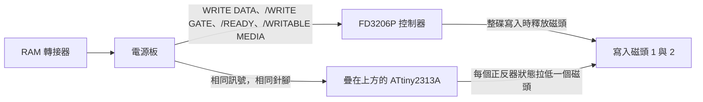

<div align="center">

<h1>fd3206-write-unlock</h1>

[English](README.md) | [日本語](README.ja.md) | [简体中文](README.zh-CN.md) | 繁體中文

<br>

<strong>在 FD3206 控制器上方焊一粒 ATtiny2313A，Famicom 磁碟機的驅動器便可以重新改寫整張磁碟。</strong>

<br>
<br>

[](https://github.com/gufranco/fd3206-write-unlock/actions/workflows/ci.yml)
[](https://github.com/gufranco/fd3206-write-unlock/releases/latest)
[](https://scorecard.dev/viewer/?uri=github.com/gufranco/fd3206-write-unlock)
[](https://github.com/gufranco/fd3206-write-unlock/actions/workflows/ci.yml)
[](LICENSE)

</div>

<p align="center">
  <a href="#安裝">安裝</a> &nbsp;|&nbsp;
  <a href="#運作原理">運作原理</a> &nbsp;|&nbsp;
  <a href="#電源板">電源板</a> &nbsp;|&nbsp;
  <a href="https://github.com/gufranco/fd3206-write-unlock/releases">發佈版本</a> &nbsp;|&nbsp;
  <a href="#常見問題">常見問題</a>
</p>

<p align="center">
<b>8</b> 個焊點 · <b>0</b> 處切線 · <b>0</b> 件額外元件 · <b>230</b> 位元組快閃記憶體 · <b>15</b> 條指令的邊緣中斷 · <b>0</b> 項 MISRA C:2012 問題 · <b>20</b> 個模擬場景
</p>

---

```text
ATtiny2313A, pin 1 over FD3206P pin 1
  solder  4 5 6 10 13 14 15 20
  clip    1 2 3 7 8 9 11 12 16 17 18 19
```

> [!IMPORTANT]
> 韌體已通過主機測試、靜態分析及模擬的全部檢查，但仍未在真實驅動器上運行過。第一次寫入請使用壞了也不要緊的磁碟。

<table>
<tr>
<td width="50%" valign="top">

**不切線，不加線**<br>
只需把 8 支針腳直接焊在 FD3206P 上。驅動器電路板不切斷任何線路，亦不加裝電阻、跳線或第二粒晶片。

</td>
<td width="50%" valign="top">

**只拉低，不驅動為高**<br>
磁頭針腳要麼輸出 0，要麼是輸入，因此不會與共用該針腳的 FD3206P 短路。

</td>
</tr>
<tr>
<td width="50%" valign="top">

**1.25 us 切換磁頭**<br>
15 條指令的組合語言中斷在 WRITE DATA 每個邊緣後 10 個週期切換磁頭，遠低於 4.7 us 的最短邊緣間隔。

</td>
<td width="50%" valign="top">

**零 MISRA 問題**<br>
C17 程式碼在啟用及關閉斷言時均按 MISRA C:2012 檢查，所有暫存器存取都隔離在一個組合語言模組中。

</td>
</tr>
<tr>
<td width="50%" valign="top">

**每條指令都被執行**<br>
20 個 simavr 場景運行每款晶片的正式版映像，只要有一條韌體指令未被執行便判為失敗；邏輯亦針對全部 65,536 種連接埠組合作出檢查。

</td>
<td width="50%" valign="top">

**發佈的就是測試過的二進位檔**<br>
每個 GitHub 發佈版本都附有流水線建置並測試過的同一個 hex 及其 SHA-256。

</td>
</tr>
</table>

## 問題

1988 年底以後生產的驅動器以三美 FD3206P 控制器取代了較早的 FD7201P。它容許 RAM 轉接器改寫單一檔案，但寫入一旦覆蓋整個碟面，便會立即釋放寫入磁頭，RAM 轉接器隨即報告錯誤 26。在這類驅動器上，無法備份或還原整張磁碟。

## 解決方案

經典做法是在控制器以外重建驅動器的寫入級：一個在 WRITE DATA 每個下降緣翻轉的正反器，以及一個只在 /READY、/WRITABLE MEDIA 和 /WRITE GATE 全為低電平時才驅動一個磁頭的閘控。本韌體就是這個寫入級，放在疊焊於控制器之上的晶片裏。

| | 本韌體 | GAL16V8 改裝晶片 | 經典接線改裝 |
|:--|:--:|:--:|:--:|
| 新增元件 | 1 粒晶片 | 1 粒晶片 | 74LS76 與 74LS45 |
| 驅動器電路板切線 | 沒有 | 沒有 | 2 處 |
| 額外連線 | 沒有 | 1 條，1 腳至 19 腳 | 多條 |
| 磁頭針腳 | 只拉低 | 雙向驅動 | 開集極 |
| 兩者同時寫入的單一檔案存檔 | 不會短路 | 可能與控制器對衝 | 不受影響，控制器已被斷開 |
| 原始碼與測試 | MIT，經過模擬，符合 MISRA | 開源版本提供 CUPL 原始碼 | 電路圖 |

## 運作原理



與經典寫入改裝的邏輯相同：一個在 WRITE DATA 每個下降緣翻轉狀態的正反器，以及一個只在 /READY、/WRITABLE MEDIA 和 /WRITE GATE 全為低電平時才容許驅動一個磁頭的閘控。

- **邊緣中斷。** WRITE DATA 接到 6 腳，即 ATtiny 的 INT0。一段 15 條指令的組合語言處理程式先把下一個磁頭狀態寫入連接埠，再交換兩個為下一個邊緣預先計算好的數值。它不會改動旗標，亦不觸及 C 程式碼的狀態。
- **閘控。** 主迴圈透過一次呼叫讀取三個條件並重設看門狗。條件改變時，重新計算中斷處理程式要交換的兩個數值，並在這幾條指令期間停用中斷。
- **只拉低，從不驅動為高。** 磁頭針腳要麼是輸出 0，要麼是輸入。被釋放的磁頭由驅動器本身的上拉電阻保持高電平，這與原電路中開集極解碼器的行為一致。FD3206P 與這兩支針腳共用，而只會拉低的針腳不會與它短路。
- **所有輸入都有上拉。** WRITE DATA、/WRITE GATE、/WRITABLE MEDIA 及 /READY 使用晶片內置 20 至 50 kΩ 的上拉。ATtiny 需要 3.0 V 才會讀為高電平，高於 TTL 的 2.0 V，上拉可把偏弱的 TTL 高電平抬向 5 V。電源板本身已用 10 kΩ 上拉 /WRITE GATE，這些訊號線本來就按此設計。
- **看門狗。** 60 ms。重設後所有針腳都變成輸入，兩個磁頭都會被釋放。

8 MHz 下的時序：

| 項目 | 數值 | 依據 |
|---|---|---|
| 由回應中斷至寫入磁頭 | 10 個週期，1.25 us | 處理程式的指令數 |
| 整個處理程式 | 約 30 個週期，3.75 us | 指令數，低於 4.7 us 的最短邊緣間隔 |
| 各邊緣之間的抖動 | 視乎正在執行的指令，最多 3 個週期，375 ns | AVR 中斷回應，主迴圈中最長的指令是 `ret` |
| 由閘控改變至磁頭釋放或接通 | 最差 7.4 us，7.2 MHz 時 8.2 us，上限 10 us | 模擬，在主迴圈的 64 個相位上施加改變測得 |
| 同上，期間資料邊緣以最快速率到達 | 最差 19 us，7.2 MHz 時 23 us，上限 100 us | 模擬 |
| 條件改變時停用中斷的時間 | 最多 12 個週期，1.5 us | 更新程式的指令數 |
| 時鐘容差 | 所有時序場景在 7.2、8.0 及 8.8 MHz 下均通過 | 以內部振盪器 ±10% 的頻率模擬 |

驅動器以 96.4 kHz 記錄，每個位元 10.4 us。375 ns 的抖動是一個位元的 3.6%。閘控改變發生在區塊之間至少 480 位元的間隙內，因此數微秒的閘控延遲只會令間隙稍短或稍長。

## 電源板

驅動器，即 HVC-022 或聲寶 Twin Famicom 內置的驅動器，內有兩塊電路板：

| 電路板 | 作用 | 寫入鎖定 | 解除方法 |
|---|---|---|---|
| 驅動機構，配備 FD3206P 或 FD7201P 控制器 | 讀寫磁碟 | FD3206P 在整碟寫入時釋放磁頭；FD7201P 沒有鎖定 | 本晶片，只限 FD3206P 驅動器 |
| 電源板 | 將電池或火牛的電力切換給馬達，並在 RAM 轉接器接口與驅動機構之間傳送全部訊號 | FMD-POWER-04、-05、部分 -02 及 Twin Famicom AN-500 上設有截斷寫入訊號的電路 | 第 2 步的電源板改裝 |

只有兩處鎖定都解除後，驅動器才可以整碟寫入。FD7201P 驅動器不需要晶片，但仍可能需要改裝電源板。配備 FMD-POWER-01 電源板的 FD3206P 驅動器只需要晶片。本項目「不切斷線路」的原則只針對驅動機構電路板；電源板的鎖定電路位於另一塊電路板的上游，疊放在 FD3206P 上的晶片無法觸及。

## 安裝

### 第 1 步：確認電源板版本

1. 拆下機身底部的 6 粒十字螺絲。
2. 將機身反轉，小心取下上蓋。
3. 拆下固定電池盒的 2 粒十字螺絲，把電池盒移到一旁。
4. 拆下固定電源板的螺絲，取出電源板。
5. 將元件面朝上，找出 `©198X Nintendo` 字樣及 `FMD-POWER-XX` 型號。

如果是聲寶 Twin Famicom，請略過下表，直接進行第 2d 步。

| 型號 | 鎖定電路 | 操作 |
|---|---|---|
| FMD-POWER-01 | 沒有 | 毋須操作 |
| FMD-POWER-02，沒有綠色子板 | 沒有 | 毋須操作 |
| FMD-POWER-02，有綠色子板 | 有，在子板上 | 第 2a 步 |
| FMD-POWER-03 | 沒有資料，推斷與 -02 相同 | 檢查有沒有子板；若沒有子板，而裝上晶片後整碟寫入仍然失敗，便懷疑是這塊電源板 |
| FMD-POWER-04 | 有 | 第 2b 步 |
| FMD-POWER-05 | 有 | 第 2c 步 |

### 第 2 步：解除電源板的寫入鎖定

Famicom World 的文章 [FDS Power Board Modifications](https://famicomworld.com/workshop/tech/fds-power-board-modifications/) 附有每款電路板的相片，並標示了準確的操作位置。以下步驟說明每項改動的內容；至於在你的電路板上的實際位置，請參照文章中的相片。

#### 2a. 附子板的 FMD-POWER-02

1. 拆焊並取下綠色子板。
2. 清除留下的孔中的焊錫。
3. 從子板上拆焊驅動器插座。
4. 將該插座裝入電源板原有的孔位並焊好。

完成後，電路板便與沒有鎖定的 -02 相同。

#### 2b. FMD-POWER-04

1. 拆焊或剪走標有 JP14 的元件。這樣會令鎖定電路失效。
2. 用一段短電線連接文章中標為 A 和 B 的兩點；如果附近沒有其他元件，亦可以用焊錫橋接。寫入訊號便可繞過已失效的電路到達驅動機構。

這塊電路板毋須切斷銅箔。

#### 2c. FMD-POWER-05

1. 拆焊文章中標示的兩條跳線。其中一條位於 RAM 轉接器接駁處附近兩粒黑色方形元件的下方；把這兩粒元件稍為向外扳開便可觸及。
2. 切斷文章中以紅色標示的兩條銅箔。用萬用錶確認切口兩邊已完全不導通。
3. 焊上文章中以藍色標示的兩條連線。它們會把寫入訊號重新送回驅動機構。

#### 2d. 聲寶 Twin Famicom

Twin Famicom 使用相同的三美驅動機構，配備 FD7201P 或 FD3206P，但電源板是聲寶自家的設計，因此 FMD-POWER 表並不適用。它的鎖定以兩條電線解除，毋須改裝電路板。

1. 打開 Twin Famicom，找出驅動機構排線所經過的電源板。
2. 找出兩條灰色電線：一條進入電源板，另一條從電源板引出。
3. 將兩條電線從電源板上拔出或剪斷。
4. 把兩條灰色電線互相接駁，焊牢後用熱縮套管或膠紙絕緣。寫入訊號便會直接繞過電路板上的鎖定電路。

並非每部機的電線顏色都一樣；剪線之前，請先把兩條電線都追蹤到電源板上確認。nesdev 論壇上的報告 `(截至 2026-09)`：

| 型號 | 報告 |
|---|---|
| Twin Famicom，未註明型號 | Chris Covell 於 2014 年附相片報告，兩條電線的改裝有效 |
| AN-500B，FD7201P 驅動器 | 2014 年及 2018 年各有一位機主獲告知只需兩條電線的改裝；兩人都沒有公布結果 |
| 所有配備 FD3206P 驅動器的 Twin Famicom | 兩條電線改裝後 FD3206P 的鎖定仍然存在，因此亦需要本晶片 |
| AN-505 | 2026-09-03 的一篇帖子轉述了 Discord 上的討論，指該型號沒有鎖定；沒有相片或測試佐證 |

### 第 3 步：燒錄晶片

| 工具 | 用途 | 取得方法 |
|:--|:--|:--|
| `avrdude` | 寫入熔絲及快閃記憶體 | macOS 上 `brew install avrdude`，Debian 上 `apt install avrdude` |
| USBasp，或運行 ArduinoISP 的 Arduino Uno 或 Nano | 燒錄器 | 從 Arduino IDE 範例燒錄 ArduinoISP |
| Docker 與 Python 3 | 只在自行建置韌體時需要 | [docker.com](https://www.docker.com) |

每個[發佈版本](https://github.com/gufranco/fd3206-write-unlock/releases)都為每款晶片附有一個映像，即 `fd3206-write-unlock-attiny2313a.hex` 及 `fd3206-write-unlock-attiny4313.hex`，均為流水線建置並測試過的原樣映像，並附各自的 SHA-256：

```sh
sha256sum -c fd3206-write-unlock-attiny2313a.hex.sha256
make fuses PROGRAMMER=usbasp
avrdude -c usbasp -p t2313a -U flash:w:fd3206-write-unlock-attiny2313a.hex:i
```

如要自行建置同一映像，`make` 會在版本固定的 Docker 工具鏈中建置，`make flash PROGRAMMER=usbasp` 負責燒錄。用 Arduino 作燒錄器時，指定 `PROGRAMMER=arduino_as_isp PORT=/dev/cu.usbmodemXXXX`。使用 ATtiny4313 時，在 `make fuses` 及 `make flash` 後都加上 `MCU=attiny4313`，或向 avrdude 傳入 `-p t4313` 及 ATtiny4313 的映像。

熔絲設定為：低位 `0xE4`，內部 8 MHz 振盪器，沒有時鐘輸出；高位 `0xD9`，4.3 V 欠壓重設，保留燒錄功能。新晶片以 8 分頻的 4 MHz 振盪器運行；韌體在啟動時把分頻系數設為 1，因此未設定熔絲的晶片亦可以 4 MHz 運作，但邊緣抖動會加倍，而且沒有欠壓保護。

### 第 4 步：安裝晶片，只限 FD3206P 驅動器

驅動機構上唯一新增的元件，就是焊在 FD3206P 上方、已燒錄好的 ATtiny2313A。這塊電路板上不切斷任何線路，亦不加裝電線。ATtiny4313 針腳排列相同，但其 RAM 較大，堆疊頂端位置不同，因此須使用它自己的映像。

| ATtiny2313A 針腳 | FD3206P 訊號 | 操作 |
|---|---|---|
| 4，PA1 | /WRITE GATE | 焊接 |
| 5，PA0 | /WRITABLE MEDIA | 焊接 |
| 6，PD2 INT0 | WRITE DATA | 焊接 |
| 10 | GND | 焊接 |
| 13，PB1 | /READY | 焊接 |
| 14，PB2 | 磁頭 2 | 焊接 |
| 15，PB3 | 磁頭 1 | 焊接 |
| 20 | +5 V | 焊接 |
| 1、2、3、7、8、9、11、12、16、17、18、19 | 沒有資料 | 剪走，確保不接觸任何地方 |

Famicom World 的相片把 5 腳標為 /WRITE PROTECT。電源板及 RAM 轉接器把這個訊號稱為 /writable media：低電平表示磁碟可以寫入，韌體只在這時才可以驅動磁頭。

安裝之前，請在不放入磁碟的情況下，用萬用錶在驅動器上量度：

1. 通電、未裝晶片：14 腳和 15 腳待機時不高於 5.5 V。FMD-POWER-05 電路圖顯示送到驅動板的只有 5 V 電源，因此應約為 5 V；更高會超出 ATtiny 針腳的額定值。
2. 通電、未裝晶片：用鈎式探針在 14 腳與 GND 之間接一個 1 kΩ 電阻，讀取 14 腳電壓 V；15 腳亦同樣量一次。以第 1 步的待機電壓為 V0，該針腳的源電阻為 1000 x (V0 - V) / V Ω。它必須不少於 250 Ω，這樣無論線路是由驅動板上的電阻還是 FD3206P 本身拉高，ATtiny 拉低的磁頭電流都不會超過 20 mA。低於 250 Ω 時請勿安裝。電阻只接幾秒：它可能會接通磁頭，因此不可放入磁碟。
3. 安裝後、向一張壞了也不要緊的磁碟寫入期間：被拉低的針腳不高於 0.8 V，即 ATtiny 在 20 mA 時的額定低電平。

1. 將標為「剪走」的針腳屈開或剪走，令它們無法接觸 FD3206P。FD3206P 上對應的針腳是從未有人記錄的訊號，韌體亦用不上。
2. 取出驅動機構，拆下底板，露出控制器電路板。
3. 把 ATtiny 以 1 腳對 1 腳的方式放在 FD3206P 上，兩粒晶片的缺口方向一致。
4. 把標為「焊接」的 8 支針腳焊到正下方的 FD3206P 針腳上。
5. 在斷電狀態下，用萬用錶確認相鄰針腳之間沒有接通，而且 20 腳與 10 腳之間沒有短路。FD3206P 無法更換，其上的焊錫橋接是最有可能損壞驅動器的原因。
6. 在晶片上方對應的位置貼上膠紙，再裝回底板。

### 第 5 步：在驅動器上測試

請使用一張壞了也不要緊的磁碟，並在寫入任何磁碟之前先作備份。

1. 儲存一次遊戲進度。這是 FD3206P 亦會寫入的情況，請參閱「仍未解決的一點」一節。
2. 用磁碟寫入工具改寫整張磁碟，然後重複讀取數次。
3. 用邏輯分析儀比較 6 腳的 WRITE DATA 與 14、15 腳。每個下降緣都會令低電平由一支針腳移到另一支。

如果整碟寫入仍然失敗，請檢查寫入期間 WRITE DATA 和 /WRITE GATE 有沒有到達 FD3206P 的 6 腳和 4 腳。如果沒有到達，代表電源板仍在晶片上游截斷寫入訊號。

## 行為要求

每項要求都由一個在 7.2、8.0 及 8.8 MHz 下運行每款晶片正式版韌體映像的模擬場景驗證。閘控與磁頭選擇亦針對輸入連接埠全部 65,536 種組合作出檢查。

| 要求 | 場景 |
|---|---|
| 除非 /READY、/WRITABLE MEDIA 和 /WRITE GATE 全為低電平，否則兩支磁頭針腳都必須為輸入 | 一個條件為高，100 個下降緣：每個邊緣後兩個磁頭均被釋放 |
| 寫入期間必須剛好有一支磁頭針腳為低，而且在 WRITE DATA 的每個下降緣都必須切換 | 間隔 4.7 us 的 1000 個邊緣：每個邊緣後只有一支為低，並每次換到另一支 |
| WRITE DATA 的上升緣不得改變磁頭 | 1 us 的低電平脈衝：磁頭只在下降緣改變一次 |
| 寫入開始時使用的磁頭必須與經典正反器一樣，按下降緣的計數決定，即使在磁頭釋放期間亦然 | 閘控關閉時經過 100 或 101 個邊緣，然後閘控打開：雙數時為磁頭 1，單數時為磁頭 2 |
| WRITE DATA 保持低電平時磁頭不得再次改變 | 低電平 20 us：磁頭只在下降緣改變一次 |
| 閘控打開期間到達的邊緣不得遺失 | 閘控打開後在 96 個週期位置各施加一個邊緣：之後的磁頭始終與邊緣計數一致 |
| 任何一個條件變高後 10 us 內必須釋放磁頭 | 逐一測試每個條件，之後沒有邊緣：10 us 內兩個均被釋放 |
| 所有條件變低後 10 us 內必須剛好驅動一個磁頭 | 其他條件為低時 /WRITE GATE 下降：10 us 內一支為低 |
| 寫入閘控出現突波後，磁頭最終必須處於釋放狀態 | 250 ns 的閘控脈衝：之後兩個均被釋放 |
| 啟動後不得有任何針腳為輸出，每個輸入都必須有上拉，磁頭針腳不得有上拉 | 所有輸入為高：方向暫存器全為零，四個輸入有上拉，磁頭沒有 |
| 資料邊緣以最快速率到達期間，/WRITE GATE 變高後 100 us 內必須釋放磁頭 | 最快資料中關閉閘控：100 us 內釋放，之後 100 個邊緣保持釋放 |
| 資料邊緣以最快速率到達期間，/WRITE GATE 變低後 100 us 內必須剛好驅動一個磁頭 | 最快資料中打開閘控：100 us 內一支為低，之後每個邊緣切換 |
| 韌體必須以不分頻的時鐘運行，並保持看門狗啟用 | 以 8 分頻啟動的晶片，啟動後：分頻系數 1，看門狗以 60 ms 逾時啟用 |
| 正常運作期間看門狗不得觸發 | 600 ms 的邊緣，相當於逾時時間的 10 倍：沒有重設，每個邊緣後只有一支為低 |
| 主迴圈停頓時必須由看門狗重設，並恢復寫入 | 主迴圈停止 100 ms：看門狗重設一次，之後 100 個邊緣中每次只有一支磁頭為低並交替 |

## 仍未解決的一點

儲存單一檔案時，FD3206P 仍會以自己的正反器驅動同樣的兩支針腳進行寫入，而 ATtiny 亦以自己的正反器驅動這兩支針腳。如果兩者不一致，兩個磁頭會同時被拉低，這次存檔便會寫錯。保持 FD3206P 連接的免接線改裝晶片有針對這款驅動器出售，亦有賣家明確表示其晶片的表現與無限制的 FD7201 相同；這說明在實際使用中兩個正反器是同步的。本韌體與 GAL 改裝晶片的相位完全一致：由 0 開始，先驅動磁頭 1，並在每個下降緣切換。仍有一點不同：GAL 亦會把針腳驅動為高電平，在兩者不一致時有可能壓過控制器，而只會拉低的 ATtiny 做不到。經典的雙晶片接線改裝會切斷 FD3206P 與磁頭之間的銅箔，因此不能作為任何一方的依據。用一張壞了也不要緊的磁碟在真實驅動器上存檔，便能確認。能徹底消除這個疑問的是那兩處銅箔切斷，而本項目刻意不要求這樣做。

## 數據

<!-- figures:begin -->
| 項目 | 數值 |
|---|---|
| 快閃記憶體用量 | 230 位元組 |
| 邊緣中斷處理程式 | 15 條指令 |
| 韌體原始碼 | 非空行 189 行 |
<!-- figures:end -->

數值取自正式版建置。

## 常見問題

<details>
<summary><strong>我的驅動器需要它嗎？</strong></summary>
<br>

只有控制器是 FD3206P 時才需要。打開驅動機構，查看控制器電路板上那粒大晶片的型號。FD7201P 沒有控制器鎖定，但其電源板仍可能需要安裝第 2 步的改裝。

</details>

<details>
<summary><strong>為甚麼不用 ATtiny85 等 8 腳晶片？</strong></summary>
<br>

寫入級需要 6 個 I/O：WRITE DATA、三個條件和兩個磁頭。8 腳的 ATtiny 在不放棄 RESET 的情況下只有 5 個，而放棄 RESET 便無法在線燒錄。此外只有 x313 的 GND、VCC 和 INT0 恰好位於 FD3206P 的 GND、+5 V 和 WRITE DATA 的位置，這正是可以疊焊安裝的原因。

</details>

<details>
<summary><strong>「V4」改裝晶片上翹起的兩支針腳是甚麼？</strong></summary>
<br>

是 1 腳和 19 腳，以一條電線相連。暫存器模式下的 GAL16V8 只能從 1 腳的上升緣取得正反器時鐘，而驅動器在 WRITE DATA 的下降緣翻轉，因此 GAL 把 WRITE DATA 反相後從輸出腳 19 送出，再接回自己的時鐘腳。兩者都不是重設腳。市面出售的「FD3206 Add-On Chip V4」出售時已磨走晶片標記，但其安裝相片顯示了同樣的跳線，因此很可能是同一種 GAL 設計；這是根據相片作出的推斷。ATtiny 不需要這種回接，INT0 直接在下降緣觸發中斷。

</details>

<details>
<summary><strong>可以用 Arduino IDE 建置嗎？</strong></summary>
<br>

不可以。Arduino IDE 只用來燒錄充當 ISP 燒錄器的 Arduino。韌體在版本固定的工具鏈中建置，確保每粒晶片燒錄的都是通過了 MISRA 檢查、測試及模擬的映像。

</details>

<details>
<summary><strong>可以用於聲寶 Twin Famicom 嗎？</strong></summary>
<br>

Twin Famicom 使用相同的三美驅動機構，因此配備 FD3206P 的機器可以同樣安裝本晶片。它的電源板有自己的鎖定，透過接駁兩條灰色電線解除，請參閱安裝第 2d 步。

</details>

## 版本管理

發佈版本遵循[語義化版本](https://semver.org/)，在流水線通過後由 `main` 自動產生。每個[發佈版本](https://github.com/gufranco/fd3206-write-unlock/releases)都附有發佈說明、每款晶片的韌體 hex 及其 SHA-256、已簽署建置來源的 Sigstore 證明包，以及與兩個 hex 綁定證明的 SPDX 軟件物料清單。來源證明由發佈工作流程在 GitHub 託管的執行器上產生，符合 SLSA Build Level 2。下載後可用以下指令核對：

```sh
gh attestation verify fd3206-write-unlock-attiny2313a.hex --repo gufranco/fd3206-write-unlock
```

## 支援

| 需要 | 渠道 |
|:--|:--|
| 錯誤報告或實機結果 | [GitHub Issues](https://github.com/gufranco/fd3206-write-unlock/issues) |
| 保安問題報告 | [保安政策](SECURITY.md) |

## 來源

本項目根據公開資料獨立編寫。程式碼及本 README 只參考以下資料：

| 資料 | 採用的事實 |
|---|---|
| Famicom World，「[Famicom Disk System FD3206 Write Mod](https://famicomworld.com/workshop/tech/famicom-disk-system-fd3206-write-mod/)」 | 其附標註的電路板相片中 FD3206P 的 +5 V、GND、/READY、/WRITE GATE、/WRITABLE MEDIA、WRITE DATA 焊盤；14、15 腳的磁頭走線；其 74LS76 與 74LS45 電路圖中的磁頭驅動行為 |
| Famicom World，「[FDS Power Board Modifications](https://famicomworld.com/workshop/tech/fds-power-board-modifications/)」 | 哪些電源板版本設有寫入鎖定，以及各自的解除方法 |
| nesdev 論壇帖子 [11342](https://forums.nesdev.org/viewtopic.php?t=11342)、[17037](https://forums.nesdev.org/viewtopic.php?t=17037)、[19856](https://forums.nesdev.org/viewtopic.php?t=19856) 及「[Disable copy protection on the Twin Famicom AN-505BK](https://forums.nesdev.org/viewtopic.php?p=310336)」 | Twin Famicom 電源板的改裝方法與各型號的報告 |
| Brad Taylor，「[Famicom Disk System technical reference](https://www.nesdev.org/FDS%20technical%20reference.txt)」，nesdev.org | 96.4 kHz 位元速率、10% 容差、1 us 脈衝、訊號名稱 |
| nesdev wiki，「[FDS RAM adaptor cable pinout](https://www.nesdev.org/wiki/FDS_RAM_adaptor_cable_pinout)」與「[FDS disk format](https://www.nesdev.org/wiki/FDS_disk_format)」 | 訊號名稱與極性、間隙長度 |
| Microchip 文件 8246，[ATtiny2313A/4313](https://ww1.microchip.com/downloads/en/DeviceDoc/doc8246.pdf) | 針腳排列、輸入輸出電平、中斷、看門狗及分頻器的定時寫入次序、振盪器精度、電源電壓範圍、針腳電流 |
| nesdev 論壇，[FMD-POWER-05](https://forums.nesdev.org/viewtopic.php?t=17881) 逆向電路圖 | 送到驅動板的電源只有 +5 V 和摩打用 +5 V；/write 上的 10 kΩ 上拉；訊號名 /writable media |
| [avrdude 8](https://github.com/avrdudes/avrdude/blob/main/src/avrdude.conf.in) 裝置資料庫 | 熔絲位元的意義與出廠值 |
| [FDSStick](https://www.fdsstick.com/the-latest-fd3206-modchip-v4-no-need-any-wires/) 與 [ToToTEK](https://www.tototek.com/store/index.php?main_page=product_info&products_id=228) 的 FD3206 V4 附加晶片產品頁面 | 顯示 8 個焊點和 1 腳至 19 腳跳線的安裝相片，只用於上文的比較 |

[Stephen-Arsenault/FDS-FD3206-Modchip](https://github.com/Stephen-Arsenault/FDS-FD3206-Modchip)（CC BY-SA 4.0）在同一控制器上疊放可程式邏輯元件。本項目不含該項目的任何檔案、原始碼、相片、文件文字或名稱；控制器的針腳編號是對照 Famicom World 的電路板相片確認，而非取自該項目。兩者功能相同，因為那是驅動器本身的功能；實作方式則不同：GAL 是組合邏輯加上一個經電線回接取得時鐘的暫存器，本項目則是 C 語言主迴圈加上一段組合語言中斷處理程式，交換兩個預先計算好的連接埠數值，並以開汲極方式驅動針腳。沒有任何連續 4 行或以上的程式碼相同，韌體中亦不含第三方程式碼。

## 授權

[MIT](LICENSE)
